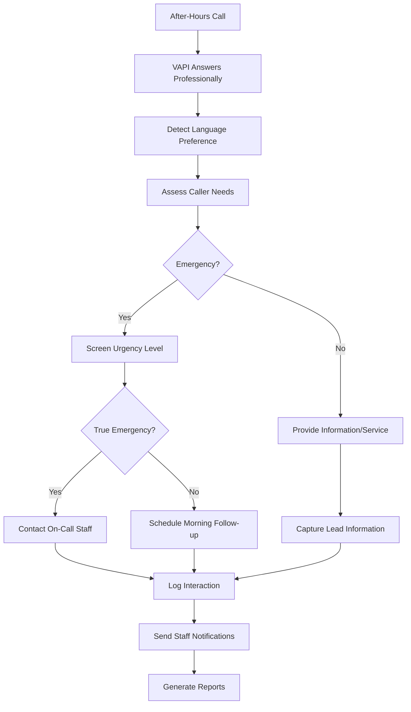
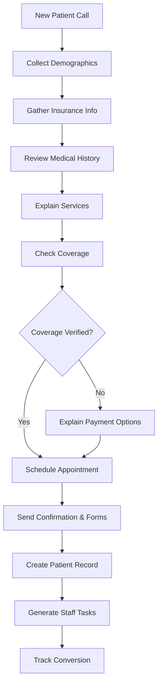
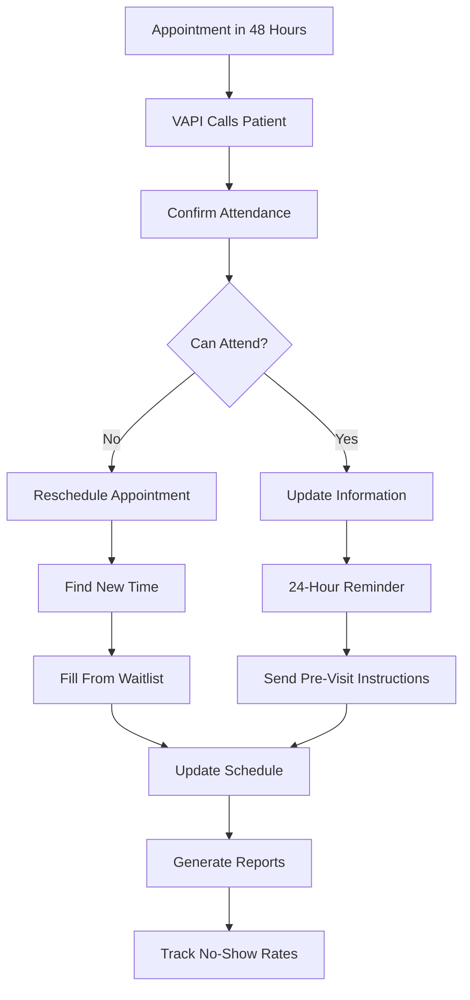
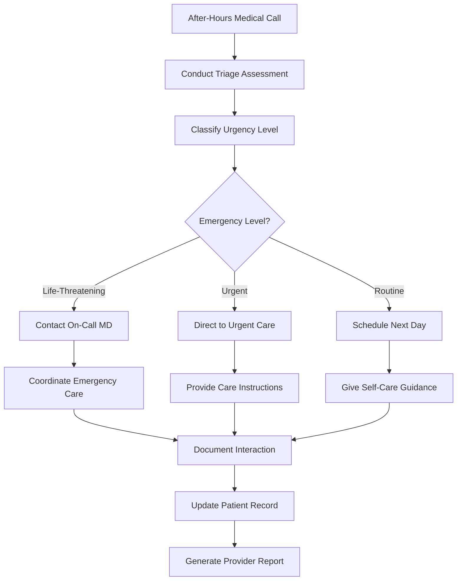
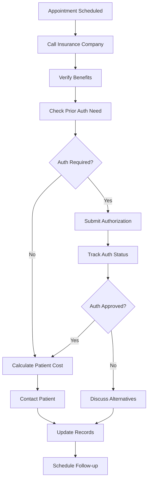
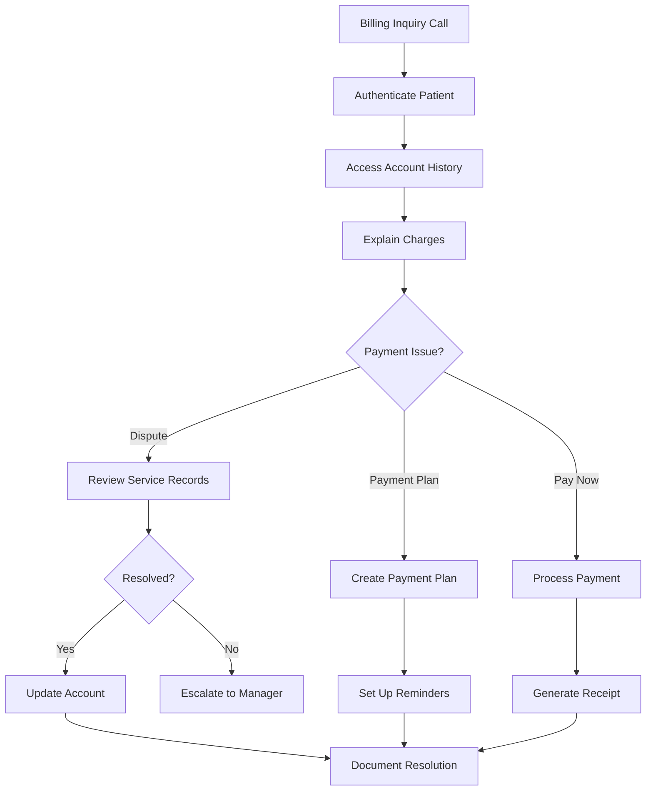
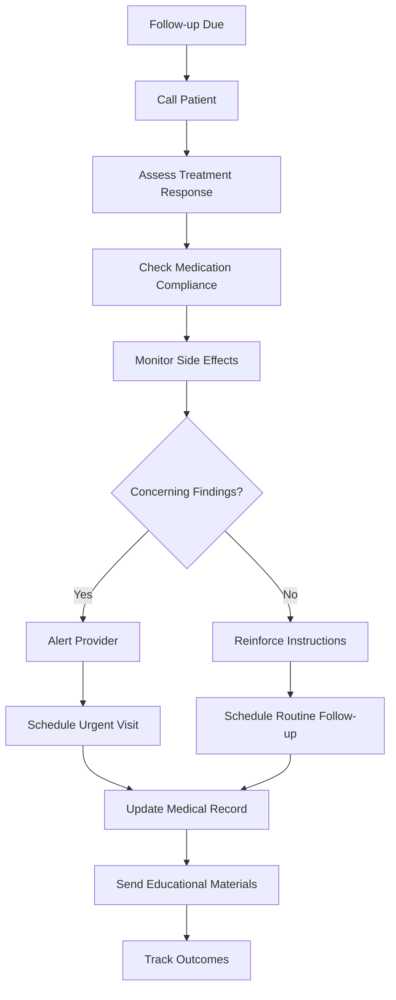
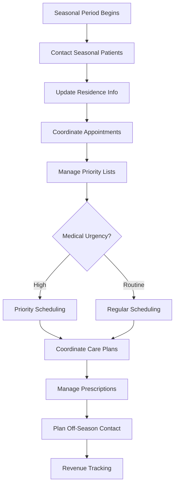
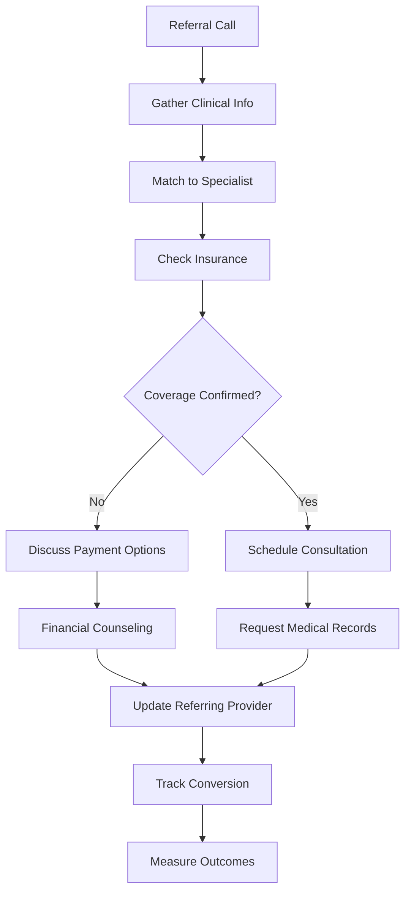
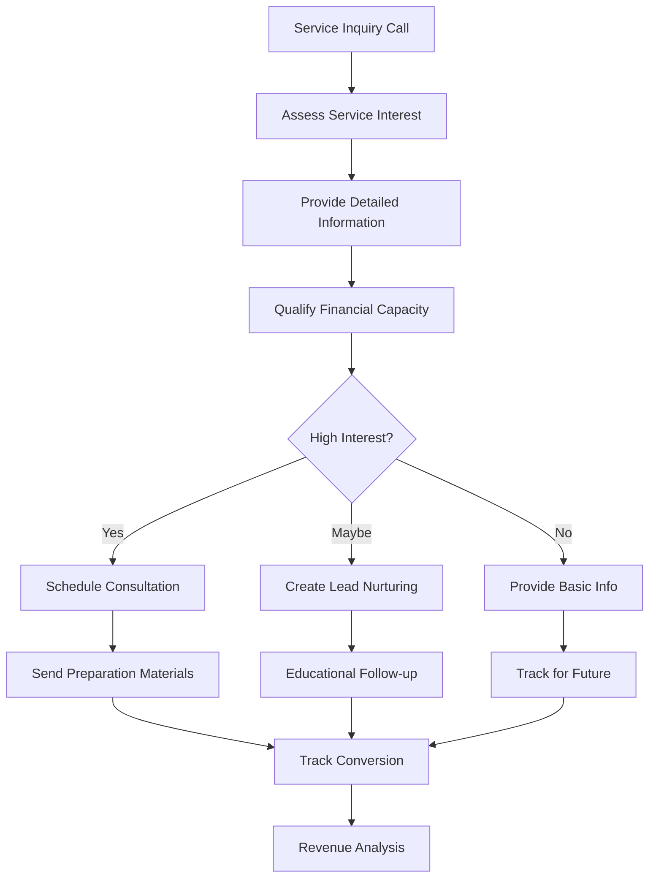

# AI Healthcare Employees - Comprehensive Implementation Guide

## Overview

This guide details 10 AI Employee implementations for medical, dental, and eye care practices in South Florida. These AI Employees handle the 75% of healthcare phone calls that don't require clinical judgment but consume staff time. Each implementation combines VAPI for intelligent phone conversations with N8N workflows for post-call automation.

---

## 1. 24/7 Virtual Receptionist

### Current Situation
Practices lose potential patients when calls go to voicemail during lunch breaks, after hours, and weekends. Patients hang up and call competitors who answer immediately. South Florida's diverse population requires bilingual support that isn't always available.

### VAPI Call Flow
The AI provides comprehensive reception services around the clock:
- Answers with professional practice greeting in English or Spanish
- Determines caller needs (new patient, existing patient, emergency, information)
- Collects basic information for new patient inquiries
- Provides practice information including hours, location, services, insurance accepted
- Handles appointment requests and scheduling inquiries
- Screens for emergency situations requiring immediate attention
- Transfers urgent calls to on-call staff when appropriate
- Captures detailed messages for staff follow-up during business hours

### Custom Tools Needed During Call
- **Language Detection System**: Automatically detect caller's preferred language
- **Practice Information Database**: Current hours, services, providers, insurance plans
- **Emergency Screening Protocol**: Decision tree for urgent vs. routine calls
- **Appointment Availability System**: Real-time schedule access for basic availability
- **New Patient Capture System**: Collect contact info and service interest

### N8N Workflow After Call
- Logs all calls with detailed interaction notes and caller information
- Creates new patient leads in CRM system with complete contact details
- Sends immediate notifications to staff for emergency situations
- Generates morning reports of after-hours calls and new patient inquiries
- Schedules follow-up calls for complex inquiries requiring staff attention
- Updates patient database with contact information and service interests

### Tools Needed After Call
- **CRM/Patient Management System**: Store new patient leads and interactions
- **Email/SMS Notification System**: Alert staff to urgent calls and new leads
- **Appointment Scheduling Platform**: Basic availability checking and booking
- **Reporting Dashboard**: Track after-hours call volume and conversion rates
- **Follow-up Management System**: Schedule staff callbacks and consultations

### Complete Flow
1. After-hours call received → VAPI answers professionally in appropriate language
2. Caller needs assessment → Determine type of inquiry and urgency level
3. Information gathering → Collect relevant details and contact information
4. Service provision → Provide requested information or assistance
5. Emergency screening → Identify and escalate true emergencies
6. Message capture → Record detailed notes for staff follow-up
7. System updates → Log interaction and create appropriate records
8. Notification → Alert staff to urgent matters and new patient leads

---

## 2. New Patient Intake Specialist

### Current Situation
Front desk staff spend 15-20 minutes per new patient call collecting demographics, insurance information, medical history, and explaining services. This creates bottlenecks and limits the number of new patients that can be processed efficiently.

### VAPI Call Flow
The AI conducts comprehensive new patient intake:
- Collects complete demographic information (name, address, phone, email, emergency contact)
- Gathers insurance information and verifies coverage details
- Reviews medical history and current medications/conditions
- Explains practice services and specialties relevant to patient needs
- Discusses insurance coverage and patient financial responsibility
- Schedules initial appointments based on urgency and availability
- Provides pre-visit instructions and required documentation
- Sends confirmation emails with practice information and forms

### Custom Tools Needed During Call
- **Insurance Verification API**: Real-time benefit checking and coverage verification
- **Medical History Template System**: Structured questions for different specialties
- **Appointment Scheduling Integration**: Access to provider calendars and availability
- **Practice Service Database**: Detailed information about all services offered
- **Patient Portal Integration**: Create patient accounts and send access information

### N8N Workflow After Call
- Creates complete patient record in practice management system
- Verifies insurance benefits and updates coverage information
- Schedules appropriate appointments based on chief complaint and urgency
- Sends welcome packet with forms, directions, and pre-visit instructions
- Creates tasks for staff to review complex medical histories
- Updates marketing systems with new patient source tracking

### Tools Needed After Call
- **Practice Management System**: Create patient records and appointments
- **Insurance Verification Platform**: Confirm benefits and coverage details
- **Patient Portal System**: Set up patient access and communication
- **Document Management**: Generate and send intake forms and instructions
- **Marketing Analytics**: Track new patient sources and conversion rates

### Complete Flow
1. New patient inquiry → Potential patient calls for first appointment
2. Demographic collection → Gather complete contact and personal information
3. Insurance verification → Collect and verify insurance coverage details
4. Medical history review → Structured interview about health status and needs
5. Service explanation → Discuss relevant practice services and specialties
6. Appointment scheduling → Book appropriate initial consultation
7. Information delivery → Send confirmation, forms, and instructions
8. Record creation → Complete patient setup in all practice systems

---

## 3. Appointment Confirmation & Reminder System

### Current Situation
Practices experience 15-20% no-show rates, costing $200-500 per missed appointment. Staff waste significant time playing phone tag trying to confirm appointments, and last-minute cancellations create scheduling gaps that reduce daily revenue.

### VAPI Call Flow
The AI manages comprehensive appointment confirmation and reminder services:
- Calls patients 48 hours before appointments to confirm attendance
- Calls again 24 hours before with final reminders and preparation instructions
- Handles rescheduling requests and finds alternative appointment times
- Explains pre-appointment requirements (fasting, medications, forms)
- Manages cancellations and immediately offers appointments to waitlist patients
- Collects updated insurance information and contact details
- Provides driving directions and parking information
- Confirms special needs or accommodations required

### Custom Tools Needed During Call
- **Appointment Calendar Integration**: Real-time access to schedule and availability
- **Patient Communication Preferences**: Track preferred contact methods and times
- **Waitlist Management System**: Immediate access to patients wanting earlier appointments
- **Pre-Appointment Instruction Database**: Specific requirements for different appointment types
- **Rescheduling Optimization Engine**: Find best alternative times for all parties

### N8N Workflow After Call
- Updates appointment status (confirmed, rescheduled, cancelled)
- Fills cancelled appointments from waitlist automatically
- Sends text/email confirmations with appointment details and instructions
- Creates preparation reminders for specific appointment types
- Updates patient contact information and communication preferences
- Generates daily schedule reports with confirmation status

### Tools Needed After Call
- **Scheduling Software**: Update appointment status and manage calendar changes
- **Waitlist Management Platform**: Automatically fill cancelled appointments
- **Patient Communication System**: Send confirmations and reminders via multiple channels
- **Reporting Dashboard**: Track confirmation rates and no-show patterns
- **Revenue Optimization System**: Maximize schedule efficiency and minimize gaps

### Complete Flow
1. Appointment reminder cycle → System identifies upcoming appointments
2. First contact (48 hours) → Confirm attendance and gather updates
3. Rescheduling handling → Manage changes and find alternative times
4. Second contact (24 hours) → Final reminder with specific instructions
5. Waitlist management → Fill cancellations from waiting patients
6. Confirmation delivery → Send written confirmations and details
7. Preparation reminders → Specific instructions for appointment type
8. Schedule optimization → Maximize daily schedule efficiency

---

## 4. Emergency Triage & After-Hours Filter

### Current Situation
Healthcare providers get called at home for non-emergencies but can't ignore calls in case of true emergencies. This disrupts personal time and creates stress when most after-hours calls can wait until the next business day.

### VAPI Call Flow
The AI provides professional emergency triage and filtering:
- Answers after-hours calls with appropriate medical practice greeting
- Conducts structured triage assessment using clinical protocols
- Evaluates symptoms for true emergency vs. urgent vs. routine care needs
- Directs patients to appropriate care level (ER, urgent care, next-day appointment)
- Contacts on-call physician only for genuine emergencies requiring immediate consultation
- Provides approved self-care instructions for minor conditions
- Schedules next-day appointments for non-emergency concerns
- Documents all interactions for provider review

### Custom Tools Needed During Call
- **Clinical Triage Protocols**: Evidence-based decision trees for symptom assessment
- **Emergency Classification System**: Standardized urgency level determination
- **On-Call Provider Database**: Current on-call schedule and contact methods
- **Self-Care Instruction Library**: Approved guidance for common minor conditions
- **Appointment Scheduling Access**: Next-day scheduling for non-emergency issues

### N8N Workflow After Call
- Logs detailed triage assessment and recommendations given
- Escalates true emergencies to on-call provider immediately
- Schedules appropriate follow-up care (next-day appointments, specialist referrals)
- Sends summary to patient's primary provider for review
- Updates patient record with after-hours interaction and advice given
- Generates reports on after-hours call patterns and triage effectiveness

### Tools Needed After Call
- **Electronic Medical Records**: Document triage assessment and advice given
- **Provider Communication System**: Alert on-call physicians to true emergencies
- **Appointment Scheduling Platform**: Book follow-up care appointments
- **Clinical Documentation System**: Maintain detailed records of all interactions
- **Quality Assurance Platform**: Monitor triage accuracy and protocol compliance

### Complete Flow
1. After-hours call → Patient calls with medical concern outside business hours
2. Triage assessment → Structured evaluation using clinical protocols
3. Urgency classification → Determine appropriate level of care needed
4. Care direction → Route to emergency, urgent care, or routine appointment
5. Provider consultation → Contact on-call physician for true emergencies only
6. Patient guidance → Provide appropriate instructions and next steps
7. Documentation → Complete clinical record of assessment and recommendations
8. Follow-up coordination → Schedule appropriate continuing care

---

## 5. Insurance Verification Assistant

### Current Situation
Staff spend hours on hold with insurance companies verifying benefits, leading to delayed appointments and surprised patients when procedures aren't covered. This creates billing disputes and reduces patient satisfaction.

### VAPI Call Flow
The AI handles comprehensive insurance verification:
- Calls insurance companies to verify patient benefits and coverage
- Confirms deductibles, copays, and out-of-pocket maximums
- Verifies coverage for specific procedures and treatments
- Obtains prior authorization requirements and processes
- Explains coverage details to patients in understandable terms
- Calculates estimated patient financial responsibility
- Identifies coverage gaps and discusses payment options
- Processes prior authorization requests when required

### Custom Tools Needed During Call
- **Insurance Company Database**: Direct phone numbers and verification processes
- **Benefit Verification APIs**: Electronic access to coverage information
- **Prior Authorization System**: Submit and track authorization requests
- **Coverage Calculator**: Determine patient financial responsibility
- **Procedure Code Database**: Current CPT codes and coverage requirements

### N8N Workflow After Call
- Updates patient records with current insurance information and benefits
- Creates alerts for procedures requiring prior authorization
- Generates patient financial responsibility estimates
- Schedules follow-up calls to discuss coverage with patients
- Tracks prior authorization status and follows up on pending requests
- Creates reports on insurance verification efficiency and denial rates

### Tools Needed After Call
- **Practice Management System**: Update insurance information and benefits
- **Prior Authorization Platform**: Track authorization requests and approvals
- **Patient Communication System**: Inform patients of coverage and costs
- **Financial Management System**: Calculate and track patient responsibility
- **Reporting Dashboard**: Monitor verification success rates and timing

### Complete Flow
1. Insurance verification need → Upcoming appointment or procedure requires verification
2. Insurance contact → Call insurance company for benefit verification
3. Coverage confirmation → Verify specific benefits and limitations
4. Prior authorization check → Determine if authorization required
5. Patient responsibility calculation → Determine out-of-pocket costs
6. Patient communication → Explain coverage and financial responsibility
7. Authorization processing → Submit required prior authorization requests
8. Documentation → Update all systems with verification results

---

## 6. Billing & Payment Coordinator

### Current Situation
Staff field constant calls about bills, payment plans, and insurance explanations. These interruptions disrupt patient care activities and require detailed knowledge of billing systems and insurance processes.

### VAPI Call Flow
The AI manages comprehensive billing and payment coordination:
- Authenticates patients and accesses billing history securely
- Explains charges in detail with service date and provider information
- Discusses insurance processing and payment application
- Handles billing disputes by reviewing service documentation
- Creates customized payment plans based on patient financial situation
- Processes payments over the phone using secure payment systems
- Explains insurance claim status and appeals processes
- Schedules payment plan installments and sends reminders

### Custom Tools Needed During Call
- **Billing System Integration**: Real-time access to patient account information
- **Payment Processing Platform**: Secure credit card and bank account processing
- **Insurance Claim Tracker**: Status of submitted claims and payments
- **Payment Plan Generator**: Create customized payment arrangements
- **Dispute Resolution System**: Access to service documentation and notes

### N8N Workflow After Call
- Updates payment records and applies payments to patient accounts
- Creates payment plan schedules with automated reminder sequences
- Generates payment confirmations and receipts for patient records
- Flags accounts requiring manager review for complex disputes
- Updates insurance claim status and tracks appeals processes
- Creates financial reports on collection rates and payment plan performance

### Tools Needed After Call
- **Accounting Software**: Process payments and update patient ledgers
- **Payment Plan Management**: Track installments and send reminders
- **Document Generation**: Create receipts, statements, and payment agreements
- **Collections Management**: Identify accounts requiring follow-up action
- **Financial Reporting**: Monitor practice revenue and collection efficiency

### Complete Flow
1. Billing inquiry → Patient calls with questions about account or charges
2. Account authentication → Verify patient identity and access records
3. Charge explanation → Detail services provided and insurance processing
4. Payment discussion → Address payment options and financial concerns
5. Dispute resolution → Review and resolve billing questions or disputes
6. Payment processing → Collect payments and create arrangements
7. Documentation → Update account records and generate confirmations
8. Follow-up setup → Schedule reminders and future payment activities

---

## 7. Prescription & Treatment Follow-up

### Current Situation
Providers need to monitor patient compliance with treatment plans, medication adherence, and healing progress, but lack efficient systems for regular patient contact and follow-up assessment.

### VAPI Call Flow
The AI conducts structured post-treatment and medication follow-up:
- Calls patients at prescribed intervals after treatment or prescription
- Conducts standardized assessment of treatment response and side effects
- Monitors medication compliance and addresses barriers to adherence
- Evaluates healing progress and identifies potential complications
- Provides reinforcement of treatment instructions and lifestyle modifications
- Schedules follow-up appointments based on progress assessment
- Escalates concerning symptoms or poor compliance to providers
- Documents all interactions for clinical record and outcome tracking

### Custom Tools Needed During Call
- **Clinical Protocol Database**: Standardized follow-up questions for different treatments
- **Medication Database**: Side effect monitoring and interaction checking
- **Treatment Timeline System**: Track expected recovery milestones
- **Symptom Assessment Tools**: Structured evaluation of patient-reported outcomes
- **Provider Alert System**: Escalate concerning findings immediately

### N8N Workflow After Call
- Updates patient medical record with follow-up assessment results
- Creates alerts for providers when patient response is concerning
- Schedules appropriate follow-up appointments based on progress
- Sends educational materials and reinforcement communications to patients
- Tracks patient outcomes and treatment effectiveness across populations
- Generates reports on medication compliance and treatment success rates

### Tools Needed After Call
- **Electronic Health Records**: Document follow-up assessments and outcomes
- **Provider Communication System**: Alert clinical staff to patient concerns
- **Appointment Scheduling Platform**: Book follow-up visits based on needs
- **Patient Education System**: Send relevant materials and instructions
- **Clinical Analytics Platform**: Track treatment outcomes and quality metrics

### Complete Flow
1. Follow-up trigger → Treatment or prescription reaches follow-up interval
2. Patient contact → Call patient for structured assessment
3. Progress evaluation → Assess treatment response and compliance
4. Symptom monitoring → Check for side effects or complications
5. Education reinforcement → Review instructions and address questions
6. Clinical decision → Determine need for provider intervention
7. Appointment scheduling → Book follow-up visits as appropriate
8. Documentation → Update medical record with assessment results

---

## 8. Seasonal Patient Coordinator (South Florida Specific)

### Current Situation
South Florida practices face unique challenges with seasonal patients ("snowbirds") who need appointments during winter months while maintaining relationships with year-round residents. This creates scheduling chaos and revenue fluctuations.

### VAPI Call Flow
The AI manages seasonal patient coordination throughout the year:
- Maintains year-round contact with seasonal patients to track their schedules
- Coordinates appointment availability during peak seasonal months
- Manages waiting lists for seasonal patients and prioritizes based on medical needs
- Maintains relationships with seasonal patients during off-season months
- Coordinates care continuity with northern providers when patients travel
- Handles medication refills and prescription transfers for traveling patients
- Schedules comprehensive annual visits during seasonal residence periods
- Manages communication preferences for seasonal vs. year-round patients

### Custom Tools Needed During Call
- **Seasonal Patient Database**: Track residence patterns and availability
- **Geographic Coordination System**: Manage care with out-of-state providers
- **Prescription Transfer Platform**: Coordinate medications across locations
- **Appointment Priority System**: Balance seasonal and year-round patient needs
- **Communication Management**: Track seasonal contact preferences and addresses

### N8N Workflow After Call
- Updates seasonal patient database with current residence and contact information
- Coordinates care plans with out-of-state providers and specialists
- Manages prescription transfers and medication continuity
- Creates seasonal appointment priority lists based on medical needs
- Generates reports on seasonal patient volume and revenue impact
- Maintains year-round communication schedule for relationship management

### Tools Needed After Call
- **Patient Relationship Management**: Track seasonal patterns and preferences
- **Care Coordination Platform**: Communicate with external providers
- **Prescription Management System**: Handle medication transfers and refills
- **Revenue Planning Tools**: Forecast seasonal demand and capacity needs
- **Communication Automation**: Maintain year-round patient relationships

### Complete Flow
1. Seasonal tracking → Monitor patient residence patterns and travel plans
2. Availability coordination → Manage appointment capacity during peak season
3. Priority management → Balance seasonal and year-round patient needs
4. Care continuity → Coordinate with northern providers and specialists
5. Medication management → Handle prescription transfers and refills
6. Relationship maintenance → Maintain contact during off-season periods
7. Revenue optimization → Maximize seasonal appointment efficiency
8. Planning coordination → Prepare for next seasonal cycle

---

## 9. Referral & Second Opinion Handler

### Current Situation
Practices miss referral opportunities when patients call but staff are busy with patient care. Second opinion seekers often call competitors first, and practices lack efficient systems for qualifying and scheduling these valuable opportunities.

### VAPI Call Flow
The AI manages referral and second opinion coordination:
- Receives referral calls from other providers and patients seeking specialists
- Gathers complete referral information including urgency and clinical details
- Explains practice specialties and experience with specific conditions
- Qualifies patient needs and matches to appropriate providers
- Schedules consultations and coordinates necessary documentation
- Handles second opinion requests with appropriate sensitivity and professionalism
- Coordinates care plans with referring providers for continuity
- Manages insurance authorization requirements for specialty care

### Custom Tools Needed During Call
- **Provider Specialty Database**: Match patient needs to appropriate specialists
- **Referral Tracking System**: Manage incoming referrals and their status
- **Clinical Documentation Access**: Review relevant patient information
- **Insurance Authorization Platform**: Check coverage for specialty services
- **Provider Communication System**: Coordinate with referring physicians

### N8N Workflow After Call
- Creates referral files with complete patient information and clinical needs
- Schedules appropriate consultations based on urgency and availability
- Coordinates necessary documentation and medical records transfer
- Manages insurance authorization processes for specialty care
- Communicates consultation results back to referring providers
- Tracks referral conversion rates and relationship management

### Tools Needed After Call
- **Referral Management Platform**: Organize and track all incoming referrals
- **Provider Communication System**: Maintain relationships with referring doctors
- **Medical Records Transfer**: Secure exchange of patient information
- **Revenue Tracking**: Monitor referral value and conversion rates
- **Quality Assurance**: Track patient outcomes and satisfaction

### Complete Flow
1. Referral received → Patient or provider calls requesting specialty consultation
2. Information gathering → Collect complete clinical and administrative details
3. Provider matching → Identify appropriate specialist based on needs
4. Insurance verification → Confirm coverage for specialty services
5. Appointment scheduling → Book consultation based on urgency
6. Documentation coordination → Arrange medical records transfer
7. Provider communication → Update referring physician with plans
8. Follow-up management → Track consultation results and outcomes

---

## 10. Service Information & Lead Qualifier

### Current Situation
Staff interrupt patient care to answer basic questions about services, costs, and availability. Practices miss opportunities to qualify interest in elective procedures and cosmetic services that can significantly increase revenue.

### VAPI Call Flow
The AI provides comprehensive service information and lead qualification:
- Answers detailed questions about all practice services and procedures
- Explains elective and cosmetic procedure options with benefits and costs
- Qualifies patient interest level and financial capacity for elective services
- Provides preliminary cost estimates and financing options
- Schedules consultations for complex procedures requiring evaluation
- Educates patients about preparation requirements and recovery expectations
- Handles insurance coverage questions for various service categories
- Captures leads for marketing follow-up and relationship nurturing

### Custom Tools Needed During Call
- **Service Information Database**: Comprehensive details on all practice offerings
- **Cost Estimation System**: Pricing for procedures and consultation fees
- **Financing Options Platform**: Available payment plans and financing programs
- **Lead Qualification System**: Assess interest level and purchase probability
- **Consultation Scheduling Integration**: Book evaluation appointments efficiently

### N8N Workflow After Call
- Creates qualified lead profiles with service interest and financial capacity
- Schedules appropriate consultations based on service complexity
- Sends educational materials and procedure information to interested patients
- Updates marketing systems with lead qualification and interest levels
- Creates follow-up sequences for nurturing leads through decision process
- Tracks conversion rates from inquiry to procedure completion

### Tools Needed After Call
- **Lead Management System**: Organize and track service inquiries and qualifications
- **Marketing Automation Platform**: Nurture leads with educational content
- **Consultation Scheduling System**: Book evaluations and procedure planning
- **Revenue Tracking Platform**: Monitor elective procedure conversion and value
- **Patient Education System**: Deliver relevant information and materials

### Complete Flow
1. Service inquiry → Patient calls asking about specific services or procedures
2. Information delivery → Provide comprehensive service details and benefits
3. Interest qualification → Assess patient motivation and financial capacity
4. Cost discussion → Explain pricing and financing options available
5. Consultation scheduling → Book evaluation appointments for complex procedures
6. Education provision → Send relevant materials and preparation information
7. Lead nurturing → Create follow-up sequences for decision support
8. Conversion tracking → Monitor inquiry to procedure completion rates

---

## Summary

These AI Healthcare Employees transform medical practice operations by handling the 75% of phone calls that require professional communication but not clinical judgment. Each implementation combines:

- **VAPI**: Intelligent, bilingual phone conversations that maintain professional healthcare standards
- **Custom Tools**: Real-time access to practice management, insurance, and clinical systems
- **N8N Workflows**: Automated post-call processing and patient care coordination
- **Integration Systems**: Seamless connection with existing healthcare technology

**Key Benefits:**
- **Revenue Protection**: Never lose patients to voicemail - capture 24/7 inquiries
- **Cost Reduction**: Replace 1-2 front desk positions saving $60K-80K annually
- **Revenue Growth**: Reduce no-shows by 10-15% adding $50K-150K additional revenue
- **Stress Reduction**: Only get called for true emergencies, not routine questions
- **Competitive Advantage**: Professional availability while competitors send calls to voicemail
- **Bilingual Support**: Serve South Florida's diverse population effectively

**South Florida Specific Advantages:**
- Handle seasonal patient volume fluctuations
- Bilingual English/Spanish support for diverse population
- Manage tourist season appointment demands
- Coordinate care for traveling seasonal residents

**Implementation Priority:**
1. Start with 24/7 Virtual Receptionist (immediate patient capture)
2. Add Appointment Confirmation System (reduce no-shows)
3. Implement New Patient Intake (increase capacity)
4. Roll out Emergency Triage (get personal life back)
5. Add remaining systems based on practice-specific needs

Each AI Employee pays for itself within 30-60 days through revenue protection, cost savings, and captured opportunities while providing superior patient experience and allowing clinical staff to focus on patient care rather than administrative phone tasks.
