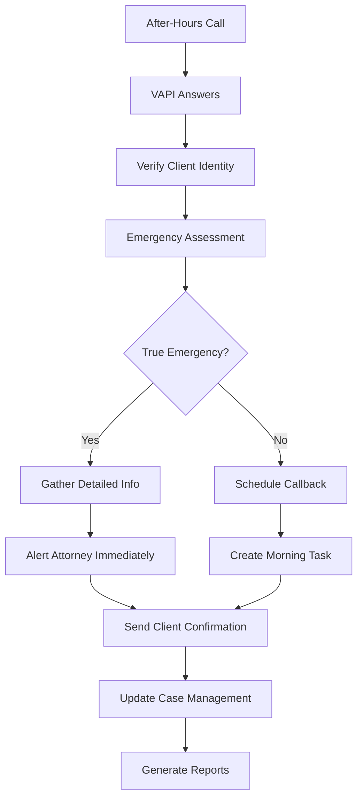
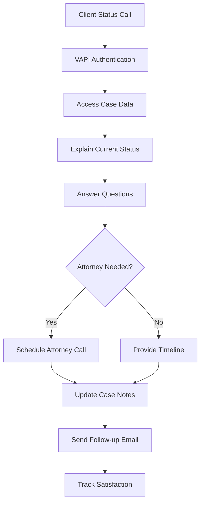
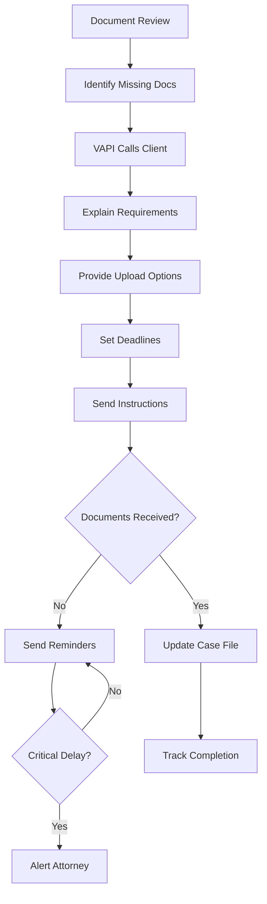
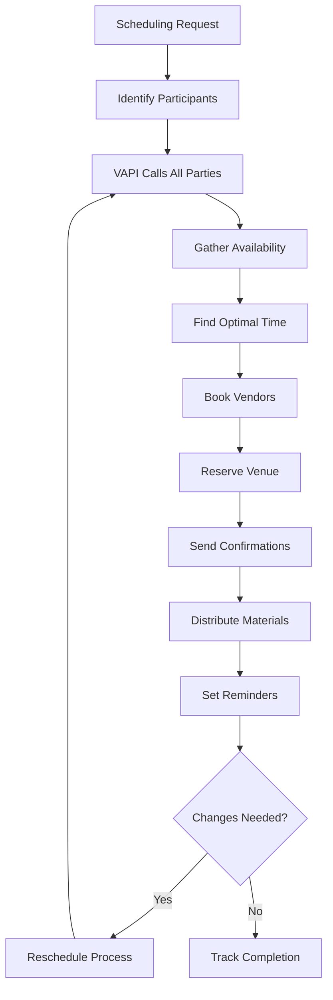
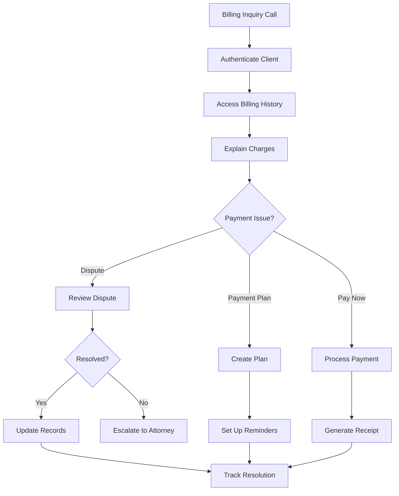
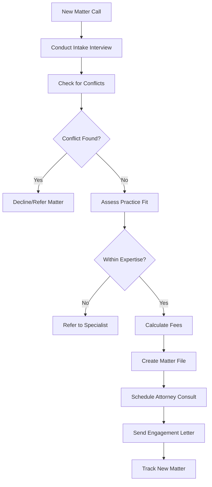
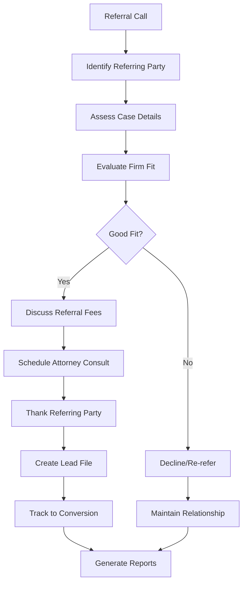
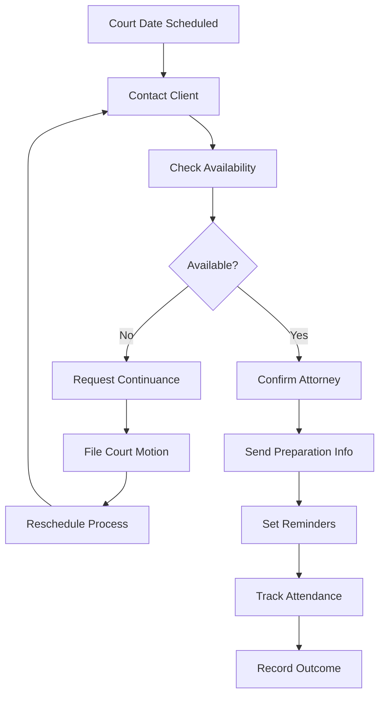
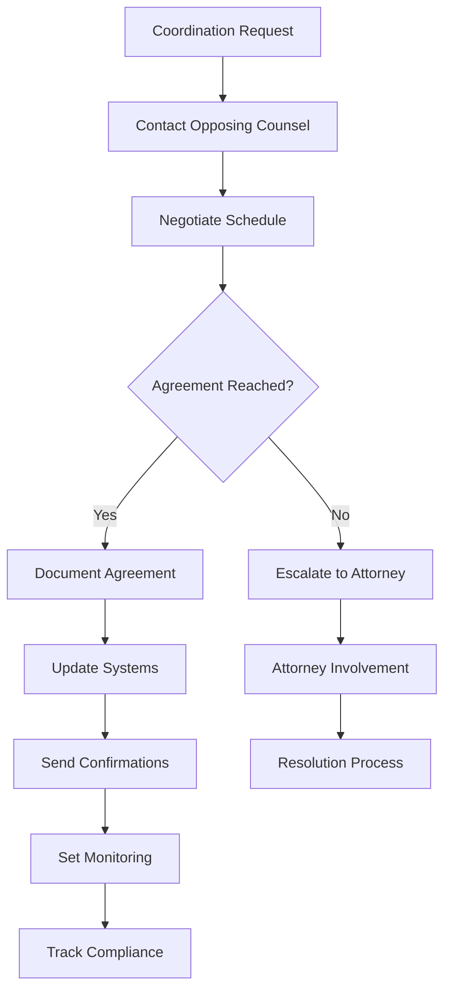
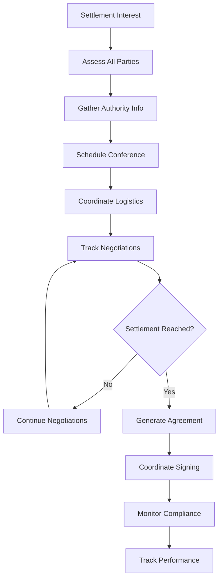

# AI Legal Employees - Comprehensive Implementation Guide

## Overview

This guide details 10 AI Employee implementations for law firms that handle the 80% of phone calls that don't require legal judgment but consume attorney time. Each AI Employee combines VAPI for intelligent phone conversations with N8N workflows for post-call automation.

---

## 1. AI After-Hours Call Triage

### Current Situation
Attorneys receive calls at all hours from panicked clients who believe every issue is urgent. This disrupts personal time and creates unnecessary stress when most calls can wait until business hours.

### VAPI Call Flow
The AI conducts a structured emergency assessment:
- Verifies client identity and case information
- Asks "Is this a true emergency requiring immediate action tonight?"
- Evaluates urgency based on specific criteria:
  - Court deadlines within 24 hours
  - Active arrest situations
  - Statute of limitations expiring
  - Safety concerns or threats
  - Time-sensitive legal documents
- For emergencies: gathers detailed information and escalates immediately
- For non-emergencies: schedules callback, provides reassurance, logs detailed notes

### Custom Tools Needed During Call
- **Client Database Lookup**: Verify caller identity and active cases
- **Case Calendar Integration**: Check for upcoming deadlines and court dates
- **Emergency Criteria Engine**: Decision tree for true vs. perceived emergencies
- **Attorney Availability System**: Real-time status of on-call attorney
- **SMS/Email Alert System**: Immediate notification for true emergencies

### N8N Workflow After Call
- Logs all call details with timestamp and urgency classification
- For emergencies: sends immediate alerts to attorney via SMS, email, and phone
- For non-emergencies: creates morning task list with priority ranking
- Sends client confirmation message with next steps
- Updates case management system with interaction notes
- Generates weekly reports on after-hours call patterns

### Tools Needed After Call
- **Case Management System API**: Update client interaction history
- **Task Management Platform**: Create attorney to-do items
- **Email/SMS Services**: Send confirmations and notifications
- **Calendar System**: Schedule follow-up calls
- **Reporting Dashboard**: Track call volume and urgency patterns

### Complete Flow
1. Client calls after hours → VAPI answers professionally
2. Identity verification → Database lookup confirms client status
3. Emergency assessment → Structured questioning determines urgency
4. Decision routing → Emergency path vs. non-emergency path
5. Information gathering → Detailed notes and context collection
6. Immediate action → Alerts sent for emergencies, scheduling for routine
7. Client confirmation → Professional response with clear next steps
8. System updates → All platforms updated with interaction data

---

## 2. AI Client Status Update Handler

### Current Situation
Attorneys spend approximately 30% of their phone time answering repetitive "What's happening with my case?" calls. These interruptions break concentration and prevent attorneys from focusing on substantive legal work.

### VAPI Call Flow
The AI provides comprehensive case status updates:
- Authenticates client identity using multiple verification methods
- Accesses current case information from management system
- Explains case status in plain language, avoiding legal jargon
- Provides timeline updates and next expected milestones
- Addresses common client concerns and questions
- Identifies when attorney consultation is actually needed
- Schedules follow-up calls or meetings as appropriate

### Custom Tools Needed During Call
- **Case Management API**: Real-time access to case status and updates
- **Client Authentication System**: Multi-factor identity verification
- **Legal Plain Language Translator**: Convert legal terms to client-friendly explanations
- **Timeline Tracking System**: Access to case milestones and deadlines
- **Document Status Tracker**: Monitor pending documents and filings

### N8N Workflow After Call
- Logs detailed interaction with client concerns and questions asked
- Updates client communication preferences and frequency requests
- Identifies cases requiring attorney attention based on client feedback
- Schedules appropriate follow-up communications
- Generates satisfaction metrics and tracks client sentiment
- Creates alerts for cases showing client frustration or confusion

### Tools Needed After Call
- **CRM System**: Update client interaction history and preferences
- **Attorney Dashboard**: Flag cases needing attorney review
- **Automated Email System**: Send follow-up summaries and documents
- **Analytics Platform**: Track client satisfaction and communication effectiveness
- **Calendar Integration**: Schedule attorney consultations when needed

### Complete Flow
1. Client calls for status update → VAPI greets professionally
2. Identity verification → Multi-step authentication process
3. Case lookup → Real-time access to current case information
4. Status explanation → Plain language summary of current status
5. Q&A session → Address specific client concerns and questions
6. Next steps → Clear timeline and expectations setting
7. Follow-up scheduling → Arrange future updates if needed
8. Documentation → Complete interaction logging and analysis

---

## 3. AI Document Collection Specialist

### Current Situation
Attorneys and staff waste significant time chasing clients for required documents, medical records, financial statements, and signed paperwork. This creates bottlenecks that delay case progress and reduce efficiency.

### VAPI Call Flow
The AI systematically manages document collection:
- Reviews case file to identify all outstanding documents
- Contacts clients with specific document requests and explanations
- Explains why each document is needed and how it impacts the case
- Provides multiple submission options (email, portal, fax, mail)
- Sets clear deadlines and explains consequences of delays
- Offers assistance with obtaining difficult documents
- Follows up persistently until documents are received

### Custom Tools Needed During Call
- **Document Tracking System**: Real-time status of all required documents
- **Case Timeline Calculator**: Impact analysis of document delays
- **Document Portal Integration**: Generate secure upload links
- **Template Library**: Standard explanations for different document types
- **Deadline Management System**: Calculate and communicate due dates

### N8N Workflow After Call
- Updates document status tracking system with call results
- Sends customized email with document list and submission instructions
- Creates automated reminder sequences based on deadline urgency
- Generates secure upload links for sensitive documents
- Alerts attorney when critical documents are overdue
- Tracks document submission rates and identifies problem patterns

### Tools Needed After Call
- **Document Management Platform**: Track and organize received documents
- **Email Automation System**: Send reminders and instructions
- **Secure File Transfer System**: Handle sensitive document uploads
- **Calendar Integration**: Schedule follow-up calls and deadlines
- **Reporting System**: Monitor collection rates and bottlenecks

### Complete Flow
1. Document review → System identifies missing documents
2. Client contact → VAPI calls with specific requests
3. Explanation → Clear reasoning for each document needed
4. Instruction → Multiple submission options provided
5. Deadline setting → Clear timelines with consequences explained
6. Follow-up scheduling → Automated reminder system activated
7. Receipt tracking → Document submission monitoring
8. Escalation → Attorney alerts for critical delays

---

## 4. AI Appointment Coordination Center

### Current Situation
Scheduling depositions, mediations, and multi-party meetings involves extensive phone tag between attorneys, court reporters, mediators, and clients. This administrative burden consumes hours of attorney time.

### VAPI Call Flow
The AI coordinates complex scheduling scenarios:
- Contacts all required parties to determine availability
- Manages calendar conflicts and proposes alternative times
- Explains deposition/mediation process to clients
- Coordinates special requirements (interpreters, accommodations)
- Handles last-minute rescheduling and cancellations
- Confirms attendance and sends preparation materials
- Manages venue selection and logistics coordination

### Custom Tools Needed During Call
- **Multi-Calendar Integration**: Access to all party calendars
- **Availability Optimization Engine**: Find optimal meeting times
- **Vendor Database**: Court reporters, mediators, interpreters
- **Conflict Detection System**: Identify scheduling conflicts
- **Location Management System**: Venue booking and coordination

### N8N Workflow After Call
- Updates all connected calendars with scheduled appointments
- Sends confirmation emails to all parties with details and requirements
- Books necessary vendors (court reporters, mediators)
- Coordinates venue reservations and special accommodations
- Creates preparation checklists for attorneys and clients
- Sets up automated reminders and follow-up sequences

### Tools Needed After Call
- **Calendar Management Platform**: Synchronize multiple calendars
- **Email Coordination System**: Send confirmations and updates
- **Vendor Management System**: Book and coordinate service providers
- **Document Automation**: Generate notices and preparation materials
- **Logistics Coordination**: Manage venues and special requirements

### Complete Flow
1. Scheduling request → Identify all required participants
2. Availability gathering → Contact all parties for open times
3. Optimization → Find best meeting time for all parties
4. Vendor coordination → Book court reporters, mediators, venues
5. Confirmation → Send detailed confirmations to all parties
6. Preparation → Distribute materials and instructions
7. Reminder management → Automated follow-up sequences
8. Last-minute changes → Handle rescheduling efficiently

---

## 5. AI Billing Questions Handler

### Current Situation
Attorneys and billing staff field constant calls about invoices, payment plans, and billing disputes. These interruptions disrupt billable work and require detailed knowledge of billing systems and policies.

### VAPI Call Flow
The AI handles comprehensive billing inquiries:
- Authenticates client and accesses billing history
- Explains charges in detail with time entry breakdowns
- Discusses payment options and creates custom payment plans
- Handles disputes by reviewing billing details and case work
- Processes payments over the phone using secure systems
- Explains billing policies and fee arrangements clearly
- Escalates complex disputes to appropriate staff

### Custom Tools Needed During Call
- **Billing System Integration**: Real-time access to invoices and payments
- **Payment Processing API**: Secure payment collection capabilities
- **Fee Calculator**: Explain billing rates and time calculations
- **Payment Plan Generator**: Create customized payment arrangements
- **Dispute Resolution System**: Track and manage billing disputes

### N8N Workflow After Call
- Updates payment records and creates payment plan schedules
- Generates payment confirmations and receipts
- Creates follow-up reminders for payment plan installments
- Flags accounts requiring attorney or billing manager review
- Tracks payment patterns and identifies collection risks
- Updates client payment preferences and billing contacts

### Tools Needed After Call
- **Accounting Software**: Process payments and update ledgers
- **Payment Reminder System**: Automated collection sequences
- **Document Generation**: Create receipts and payment agreements
- **Credit Reporting**: Update payment history and status
- **Analytics Dashboard**: Track collection rates and billing efficiency

### Complete Flow
1. Billing inquiry → Client calls with billing questions
2. Authentication → Verify client identity and account access
3. Account review → Access complete billing and payment history
4. Explanation → Detail charges and explain billing practices
5. Resolution → Address disputes or create payment arrangements
6. Payment processing → Collect payments when appropriate
7. Documentation → Update all systems with call results
8. Follow-up → Set up automated payment reminders

---

## 6. AI New Matter Intake (Existing Clients)

### Current Situation
When existing clients call with new legal issues, attorneys must conduct intake interviews, check for conflicts, determine fee structures, and create new matter files - all while ensuring proper documentation and engagement procedures.

### VAPI Call Flow
The AI manages new matter intake for existing clients:
- Conducts comprehensive intake interview for new legal matter
- Gathers detailed facts, timeline, and supporting documentation
- Performs preliminary conflict checking against existing clients
- Determines whether new matter fits within firm's practice areas
- Explains fee structures and estimates costs for new matter
- Collects retainer information and sets payment expectations
- Schedules attorney consultation for case strategy discussion

### Custom Tools Needed During Call
- **Conflict Checking System**: Search existing client database for conflicts
- **Practice Area Classifier**: Determine if matter fits firm expertise
- **Fee Calculator**: Estimate costs based on matter type and complexity
- **Intake Template System**: Structured questions for different practice areas
- **Document Upload Portal**: Collect supporting materials immediately

### N8N Workflow After Call
- Creates new matter file in case management system
- Runs comprehensive conflict checks against all firm clients
- Generates fee agreement and engagement letter templates
- Schedules attorney consultation and sends calendar invitations
- Requests necessary documents and creates upload links
- Updates client relationship management system with new matter details

### Tools Needed After Call
- **Case Management System**: Create and organize new matter files
- **Conflict Resolution Database**: Comprehensive conflict checking
- **Document Generation System**: Create engagement letters and agreements
- **Calendar Integration**: Schedule attorney consultations efficiently
- **Financial Management**: Set up billing and retainer tracking

### Complete Flow
1. New matter call → Existing client contacts firm with new legal issue
2. Matter intake → Comprehensive interview about new legal situation
3. Conflict checking → Verify no conflicts with existing clients or matters
4. Practice area fit → Determine if matter aligns with firm capabilities
5. Fee discussion → Explain costs and payment arrangements
6. Documentation → Create new matter file and engagement materials
7. Attorney scheduling → Arrange consultation for case strategy
8. Follow-up → Send engagement materials and gather required documents

---

## 7. AI Referral Qualification System

### Current Situation
Attorneys receive referral calls from other lawyers and clients but need to quickly qualify these opportunities, maintain referral relationships, and ensure proper intake procedures while managing referral fee arrangements.

### VAPI Call Flow
The AI manages referral qualification and relationship building:
- Receives referral calls and gathers referring party information
- Conducts detailed case assessment including facts, timeline, and urgency
- Evaluates case fit with firm's practice areas and current capacity
- Discusses referral fee arrangements with referring attorneys
- Explains firm's capabilities and experience with similar cases
- Schedules appropriate attorney consultation based on case urgency
- Maintains detailed referral source database for relationship management

### Custom Tools Needed During Call
- **Referral Source Database**: Track referring attorneys and past referrals
- **Case Evaluation System**: Assess case value and complexity quickly
- **Attorney Availability System**: Match cases to appropriate attorneys
- **Referral Fee Calculator**: Manage fee arrangements and agreements
- **Practice Area Expertise Database**: Match cases to firm strengths

### N8N Workflow After Call
- Updates referral source database with new referral information
- Creates qualified lead file with complete case assessment
- Schedules attorney consultation and sends calendar confirmations
- Generates referral fee agreements when applicable
- Sends thank you communication to referring party
- Tracks referral source effectiveness and relationship strength

### Tools Needed After Call
- **CRM System**: Manage referral relationships and track sources
- **Lead Management Platform**: Organize and prioritize qualified referrals
- **Contract Generation**: Create referral fee agreements automatically
- **Communication System**: Send thank you notes and updates to referral sources
- **Analytics Platform**: Track referral conversion rates and source quality

### Complete Flow
1. Referral call → Referring party contacts firm with potential case
2. Source information → Gather complete referring party details
3. Case assessment → Detailed evaluation of referred matter
4. Qualification → Determine case fit and firm capacity
5. Fee discussion → Arrange referral compensation if applicable
6. Attorney matching → Schedule consultation with appropriate attorney
7. Relationship management → Thank referring party and maintain connection
8. Tracking → Monitor referral through conversion and outcome

---

## 8. AI Court Date Coordination

### Current Situation
Attorneys must coordinate court appearances with clients, manage scheduling conflicts, handle continuances, and ensure clients are properly prepared - all while maintaining court calendar compliance and managing multiple case deadlines.

### VAPI Call Flow
The AI coordinates all aspects of court appearances:
- Contacts clients to confirm availability for scheduled court dates
- Explains court procedures and what clients should expect
- Coordinates scheduling conflicts and requests for continuances
- Prepares clients with proper attire, arrival time, and behavior expectations
- Manages transportation arrangements and special accommodations
- Handles last-minute scheduling changes and emergency rescheduling
- Confirms attorney availability and coordinates backup coverage

### Custom Tools Needed During Call
- **Court Calendar Integration**: Real-time access to court schedules and deadlines
- **Client Preparation Database**: Standard procedures for different court types
- **Continuance Request System**: Automate court filing for schedule changes
- **Attorney Coverage System**: Coordinate backup attorney assignments
- **Transportation Coordination**: Arrange client transportation when needed

### N8N Workflow After Call
- Updates court calendar and case management systems with confirmations
- Sends detailed preparation instructions to clients via email/SMS
- Files necessary continuance requests or scheduling motions
- Coordinates attorney schedules and backup coverage arrangements
- Creates client preparation checklists and reminder sequences
- Tracks court appearance completion and outcomes

### Tools Needed After Call
- **Court Filing Systems**: Submit scheduling requests and continuances electronically
- **Calendar Management**: Coordinate attorney and client schedules
- **Document Preparation**: Generate court appearance instructions and materials
- **Reminder Systems**: Automated client preparation and attendance reminders
- **Outcome Tracking**: Monitor court appearance results and follow-up actions

### Complete Flow
1. Court scheduling → Court date assigned or requested
2. Client coordination → Contact client to confirm availability
3. Attorney scheduling → Ensure attorney availability and backup coverage
4. Preparation → Send detailed instructions and expectations
5. Conflict resolution → Handle scheduling conflicts and continuance requests
6. Confirmation → Final confirmation of all parties and logistics
7. Reminders → Automated reminder sequence leading to court date
8. Follow-up → Track appearance completion and case outcomes

---

## 9. AI Opposing Counsel Coordinator

### Current Situation
Attorneys spend significant time coordinating with opposing counsel on discovery schedules, document productions, deposition dates, and routine case management - administrative tasks that don't require legal strategy but consume billable time.

### VAPI Call Flow
The AI manages routine opposing counsel coordination:
- Schedules discovery exchanges and document production deadlines
- Coordinates deposition dates and logistics with all parties
- Manages extension requests and deadline modifications
- Handles routine discovery disputes and resolution attempts
- Coordinates expert witness schedules and depositions
- Manages settlement discussion scheduling and logistics
- Maintains professional communication standards and documentation

### Custom Tools Needed During Call
- **Discovery Timeline System**: Track all discovery deadlines and obligations
- **Attorney Calendar Integration**: Access opposing counsel availability
- **Court Rules Database**: Ensure compliance with local and federal rules
- **Document Production Tracker**: Monitor exchange requirements and status
- **Professional Communication Templates**: Maintain appropriate tone and language

### N8N Workflow After Call
- Updates discovery timeline and case management systems
- Sends confirmation emails with agreed-upon schedules and deadlines
- Creates calendar entries for all parties involved
- Generates discovery compliance tracking and reminder systems
- Documents all agreements and communications for case record
- Escalates disputes or strategic decisions to attorneys

### Tools Needed After Call
- **Case Management Platform**: Update discovery schedules and deadlines
- **Email Systems**: Send professional confirmations and communications
- **Calendar Integration**: Coordinate schedules across multiple parties
- **Document Management**: Track production obligations and compliance
- **Dispute Resolution System**: Escalate unresolved coordination issues

### Complete Flow
1. Coordination need → Discovery or scheduling requirement identified
2. Opposing contact → Professional communication with opposing counsel
3. Schedule negotiation → Find mutually acceptable dates and deadlines
4. Agreement documentation → Confirm all details and obligations
5. System updates → Update all tracking and management systems
6. Confirmation → Send written confirmation to all parties
7. Monitoring → Track compliance and upcoming deadlines
8. Escalation → Alert attorneys to disputes or strategic decisions needed

---

## 10. AI Settlement Discussion Facilitator

### Current Situation
Attorneys handle initial settlement conversations, gather authority information, coordinate negotiations, and manage the logistics of settlement discussions - much of which involves administrative coordination rather than legal strategy.

### VAPI Call Flow
The AI facilitates settlement discussion logistics:
- Conducts initial settlement interest assessment with all parties
- Gathers settlement authority levels and decision-making processes
- Coordinates settlement conference scheduling with mediators and parties
- Manages information exchange requirements for settlement discussions
- Handles logistical arrangements for settlement meetings
- Tracks settlement offers and counteroffers through the process
- Coordinates final settlement documentation and signing logistics

### Custom Tools Needed During Call
- **Settlement Tracking System**: Monitor offers, counteroffers, and negotiations
- **Authority Verification**: Track decision-making authority for all parties
- **Mediator Database**: Access to qualified mediators and their availability
- **Settlement Calculator**: Basic damage calculations and range assessments
- **Confidentiality Management**: Ensure proper handling of settlement discussions

### N8N Workflow After Call
- Updates settlement tracking system with current offer status
- Schedules settlement conferences and coordinates all logistics
- Generates settlement conference preparation materials
- Manages confidentiality agreements and settlement documentation
- Coordinates final settlement documentation and execution
- Tracks settlement compliance and payment arrangements

### Tools Needed After Call
- **Settlement Management Platform**: Track negotiations and documentation
- **Document Generation**: Create settlement agreements and releases
- **Calendar Coordination**: Schedule settlement conferences and meetings
- **Payment Processing**: Handle settlement payment arrangements
- **Compliance Monitoring**: Track settlement agreement performance

### Complete Flow
1. Settlement initiation → Interest in settlement discussions identified
2. Authority gathering → Determine decision-making authority for all parties
3. Logistics coordination → Schedule settlement conferences and meetings
4. Information exchange → Coordinate necessary documentation and disclosures
5. Negotiation facilitation → Track offers and counteroffers through process
6. Agreement documentation → Generate settlement agreements and releases
7. Execution coordination → Manage signing and payment logistics
8. Compliance monitoring → Track settlement performance and compliance

---

## Summary

These AI Legal Employees transform law firm operations by handling the 80% of phone calls that require conversation skills but not legal judgment. Each implementation combines:

- **VAPI**: Intelligent phone conversations that sound natural and professional
- **Custom Tools**: Real-time access to necessary systems and data during calls
- **N8N Workflows**: Automated post-call processing and system updates
- **Integration Systems**: Seamless connection with existing law firm technology

**Key Benefits:**
- Free attorneys to focus on actual legal work
- Improve client service with 24/7 availability
- Reduce administrative staff costs
- Ensure consistent, professional communication
- Capture and qualify more opportunities
- Streamline case management and coordination

**Implementation Priority:**
1. Start with After-Hours Call Triage (immediate ROI)
2. Add Client Status Update Handler (highest volume)
3. Implement Document Collection Specialist (speeds case progress)
4. Roll out remaining systems based on firm-specific needs

Each AI Employee pays for itself within 30-60 days through time savings and captured opportunities while providing superior client service.
