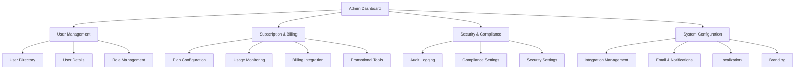
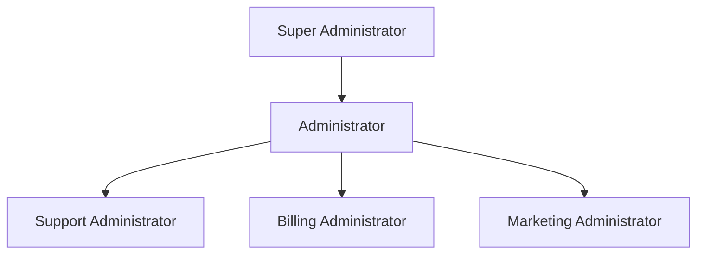
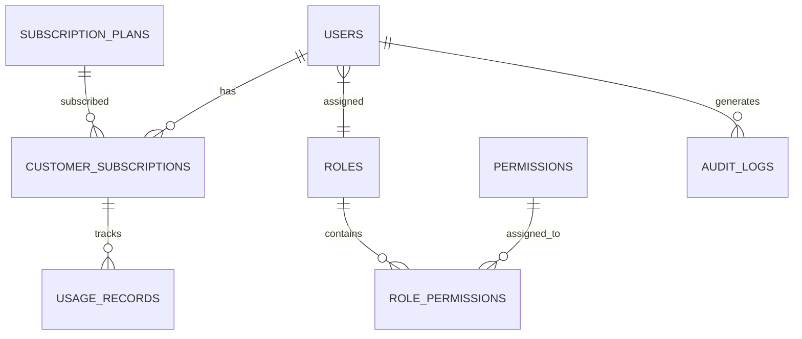
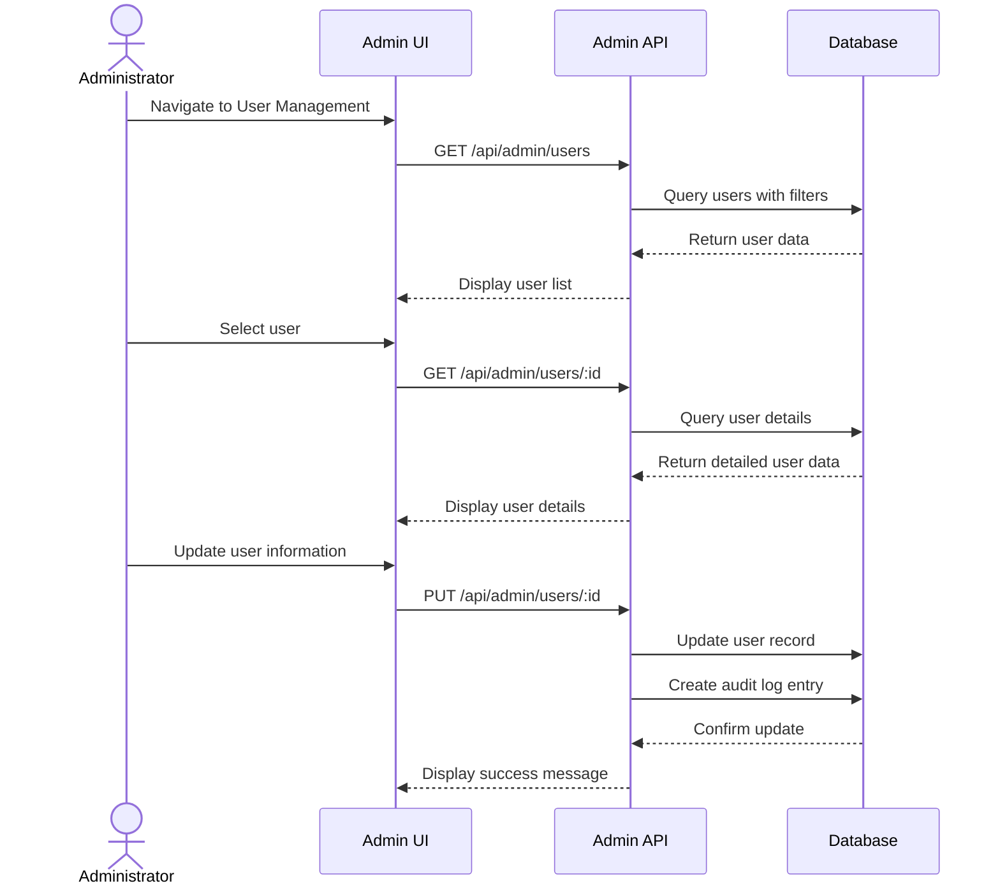

# AgenticVoice.net Admin Page Specifications

## Overview

The Admin Page serves as the central control hub for AgenticVoice.net administrators to manage users, subscriptions, pricing, security roles, and system-wide settings. This page is accessible only to users with administrative privileges and provides comprehensive tools for overseeing the entire platform.

## User Personas

### Primary User: Platform Administrator

- **Role**: Oversees the entire AgenticVoice.net platform
- **Goals**: 
  - Manage user accounts and permissions
  - Configure pricing and subscription plans
  - Monitor system usage and performance
  - Ensure security and compliance
- **Pain Points**:
  - Needs clear visibility into user activities
  - Requires efficient tools for user management
  - Must be able to quickly respond to security concerns

### Secondary User: Support Administrator

- **Role**: Handles customer support and account issues
- **Goals**:
  - Assist customers with account-related problems
  - Modify subscription details when necessary
  - Reset passwords and manage access
- **Pain Points**:
  - Needs to quickly find specific user accounts
  - Requires clear audit trails of account changes

## Features and Functionality

### 1. User Management

#### 1.1 User Directory

- Comprehensive list of all platform users with filtering and search capabilities
- Display fields:
  - User ID
  - Name
  - Email
  - Company/Organization
  - Role/Permission Level
  - Account Status (Active/Suspended/Pending)
  - Creation Date
  - Last Login Date
- Sorting options by any column
- Bulk action capabilities (activate, deactivate, change roles)

#### 1.2 User Detail View

- Detailed profile information
- Authentication history
- Subscription and billing details
- Usage statistics and limits
- Activity logs
- Notes and support history

#### 1.3 User Creation and Editing

- Manual user creation form
- Bulk user import via CSV
- Edit existing user details
- Password reset functionality
- Email verification management

#### 1.4 User Suspension and Deletion

- Ability to temporarily suspend accounts
- Permanent account deletion with confirmation
- Data retention/deletion options
- Compliance with data protection regulations

### 2. Token and Pricing Management

#### 2.1 Subscription Plan Configuration

- Create and manage subscription tiers:
  - Solo Practice
  - Small Practice (2-5 professionals)
  - Mid-Size Practice (6-15 professionals)
  - Large Practice/Clinic (custom)
- Define for each tier:
  - Monthly/annual pricing
  - Number of included voice agents
  - Call minutes/duration limits
  - Additional features/capabilities

#### 2.2 Usage Monitoring

- Real-time usage statistics by customer
- Call volume tracking
- API usage monitoring
- Resource utilization metrics
- Cost analysis tools

#### 2.3 Billing Integration

- Stripe dashboard integration
- Invoice generation and management
- Payment history
- Refund processing
- Credit application

#### 2.4 Promotional Tools

- Coupon code generation
- Free trial management
- Special offer creation
- Referral program tracking

### 3. Security and Compliance

#### 3.1 Role Management

- Create and configure security roles
- Permission assignment
- Role hierarchy visualization
- Custom role creation

#### 3.2 Audit Logging

- Comprehensive activity logging
- Admin action tracking
- Security event monitoring
- Exportable audit reports
- Retention policy configuration

#### 3.3 Compliance Settings

- HIPAA compliance controls
- Data retention policies
- Privacy settings
- Consent management
- Geographic restrictions

#### 3.4 Security Settings

- Two-factor authentication enforcement
- Password policy configuration
- Session management
- IP restriction options
- API key management

### 4. System Configuration

#### 4.1 Integration Management

- Vapi.ai API configuration
- n8n.io workflow management
- Third-party service connections
- Webhook configuration
- API key rotation

#### 4.2 Email and Notification Settings

- Email template management
- Notification rules
- Alert thresholds
- Communication preferences

#### 4.3 Localization Settings

- Language configuration
- Regional settings
- Time zone management
- Currency display options

#### 4.4 Branding Settings

- White-label options
- Custom domain management
- Logo and color scheme settings
- Email branding

## User Interface Design

### Layout

- **Responsive Design**: Full functionality on all device sizes
- **Navigation**: Left sidebar with collapsible categories
- **Header**: Quick actions, notifications, user profile
- **Main Content Area**: Card-based layout with responsive grid
- **Footer**: Version info, support links, legal information

### Key UI Components

#### Header Components

- **Search Bar**: Global search functionality
- **Notification Center**: System alerts and updates
- **User Profile Menu**: Quick access to profile and settings
- **Help Button**: Context-sensitive help documentation

#### Navigation Components

- **Primary Navigation**: Main feature categories
- **Secondary Navigation**: Feature-specific sub-navigation
- **Quick Links**: Frequently accessed tools
- **Status Indicators**: System health and alerts

#### Content Components

- **Data Tables**: For user listings and management
- **Detail Cards**: For user profiles and subscription details
- **Form Components**: For data entry and editing
- **Modal Dialogs**: For confirmations and quick actions
- **Dashboard Widgets**: For metrics and quick insights

### Visual Design

- Follow the AgenticVoice.net design system
- Use the primary color palette for main UI elements
- Apply secondary colors for accents and highlights
- Implement consistent typography hierarchy
- Incorporate micro-interactions for better UX

## Database Schema

### Users Table

```
users
├── id (UUID, PK)
├── email (VARCHAR, unique)
├── name (VARCHAR)
├── company_name (VARCHAR)
├── hashed_password (VARCHAR)
├── role_id (UUID, FK to roles)
├── status (ENUM: active, suspended, pending)
├── email_verified (BOOLEAN)
├── phone_number (VARCHAR)
├── created_at (TIMESTAMP)
├── updated_at (TIMESTAMP)
├── last_login_at (TIMESTAMP)
└── deleted_at (TIMESTAMP, nullable)
```

### Roles Table

```
roles
├── id (UUID, PK)
├── name (VARCHAR)
├── description (TEXT)
├── is_system (BOOLEAN)
├── created_at (TIMESTAMP)
└── updated_at (TIMESTAMP)
```

### Permissions Table

```
permissions
├── id (UUID, PK)
├── name (VARCHAR)
├── description (TEXT)
├── resource (VARCHAR)
├── action (VARCHAR)
├── created_at (TIMESTAMP)
└── updated_at (TIMESTAMP)
```

### Role Permissions Table

```
role_permissions
├── id (UUID, PK)
├── role_id (UUID, FK to roles)
├── permission_id (UUID, FK to permissions)
├── created_at (TIMESTAMP)
└── updated_at (TIMESTAMP)
```

### Subscription Plans Table

```
subscription_plans
├── id (UUID, PK)
├── name (VARCHAR)
├── description (TEXT)
├── monthly_price (DECIMAL)
├── annual_price (DECIMAL)
├── voice_agent_limit (INTEGER)
├── call_minutes_limit (INTEGER)
├── features (JSONB)
├── is_active (BOOLEAN)
├── created_at (TIMESTAMP)
└── updated_at (TIMESTAMP)
```

### Customer Subscriptions Table

```
customer_subscriptions
├── id (UUID, PK)
├── user_id (UUID, FK to users)
├── plan_id (UUID, FK to subscription_plans)
├── stripe_subscription_id (VARCHAR)
├── status (ENUM: active, canceled, past_due)
├── current_period_start (TIMESTAMP)
├── current_period_end (TIMESTAMP)
├── cancel_at_period_end (BOOLEAN)
├── created_at (TIMESTAMP)
└── updated_at (TIMESTAMP)
```

### Usage Records Table

```
usage_records
├── id (UUID, PK)
├── user_id (UUID, FK to users)
├── subscription_id (UUID, FK to customer_subscriptions)
├── record_date (DATE)
├── call_minutes_used (INTEGER)
├── api_calls_count (INTEGER)
├── voice_agents_active (INTEGER)
├── created_at (TIMESTAMP)
└── updated_at (TIMESTAMP)
```

### Audit Logs Table

```
audit_logs
├── id (UUID, PK)
├── user_id (UUID, FK to users)
├── action (VARCHAR)
├── resource_type (VARCHAR)
├── resource_id (VARCHAR)
├── description (TEXT)
├── ip_address (VARCHAR)
├── user_agent (VARCHAR)
├── created_at (TIMESTAMP)
```

## Security Roles and Permissions

### Role Hierarchy

1. **Super Administrator**
   - Full access to all system features
   - Can create and manage other administrators
   - Access to system configuration and security settings

2. **Administrator**
   - Access to user management
   - Access to subscription management
   - Limited access to system configuration
   - Cannot modify security settings

3. **Support Administrator**
   - View-only access to user accounts
   - Can reset passwords and modify basic account details
   - Cannot access billing or subscription management
   - Cannot modify system settings

4. **Billing Administrator**
   - Access to subscription and billing management
   - Limited access to user accounts (view only)
   - Cannot modify system settings

5. **Marketing Administrator**
   - Access to marketing page management
   - Access to analytics and reporting
   - Cannot access user management or billing

### Permission Categories

1. **User Management**
   - view:users
   - create:users
   - update:users
   - delete:users
   - suspend:users
   - reset:user_password

2. **Role Management**
   - view:roles
   - create:roles
   - update:roles
   - delete:roles
   - assign:roles

3. **Subscription Management**
   - view:subscriptions
   - create:subscriptions
   - update:subscriptions
   - cancel:subscriptions
   - view:billing
   - process:refunds

4. **System Configuration**
   - view:settings
   - update:settings
   - view:integrations
   - update:integrations

5. **Security Settings**
   - view:security
   - update:security
   - view:audit_logs

## API Endpoints

### User Management Endpoints

- `GET /api/admin/users` - List all users with pagination and filtering
- `GET /api/admin/users/:id` - Get detailed user information
- `POST /api/admin/users` - Create a new user
- `PUT /api/admin/users/:id` - Update user information
- `DELETE /api/admin/users/:id` - Delete a user
- `POST /api/admin/users/:id/suspend` - Suspend a user
- `POST /api/admin/users/:id/activate` - Activate a user
- `POST /api/admin/users/:id/reset-password` - Reset user password

### Role Management Endpoints

- `GET /api/admin/roles` - List all roles
- `GET /api/admin/roles/:id` - Get detailed role information
- `POST /api/admin/roles` - Create a new role
- `PUT /api/admin/roles/:id` - Update role information
- `DELETE /api/admin/roles/:id` - Delete a role
- `GET /api/admin/permissions` - List all permissions
- `POST /api/admin/roles/:id/permissions` - Assign permissions to a role

### Subscription Management Endpoints

- `GET /api/admin/subscription-plans` - List all subscription plans
- `POST /api/admin/subscription-plans` - Create a new subscription plan
- `PUT /api/admin/subscription-plans/:id` - Update a subscription plan
- `DELETE /api/admin/subscription-plans/:id` - Delete a subscription plan
- `GET /api/admin/subscriptions` - List all customer subscriptions
- `GET /api/admin/subscriptions/:id` - Get detailed subscription information
- `PUT /api/admin/subscriptions/:id` - Update subscription details
- `POST /api/admin/subscriptions/:id/cancel` - Cancel a subscription

### System Configuration Endpoints

- `GET /api/admin/settings` - Get system settings
- `PUT /api/admin/settings` - Update system settings
- `GET /api/admin/integrations` - List all integrations
- `PUT /api/admin/integrations/:id` - Update integration settings

### Audit and Security Endpoints

- `GET /api/admin/audit-logs` - List audit logs with filtering
- `GET /api/admin/security` - Get security settings
- `PUT /api/admin/security` - Update security settings

## User Flows

### User Management Flow

1. Administrator navigates to User Management section
2. System displays paginated list of users with search and filter options
3. Administrator can:
   - Click on a user to view details
   - Use bulk actions to modify multiple users
   - Create a new user via the "Add User" button
4. When viewing user details, administrator can:
   - Edit user information
   - Change user role
   - Reset password
   - Suspend or delete account
   - View activity history

### Subscription Management Flow

1. Administrator navigates to Subscription Management section
2. System displays list of subscription plans
3. Administrator can:
   - Create new subscription plans
   - Modify existing plans
   - View subscribers for each plan
4. When managing a specific subscription:
   - View payment history
   - Process refunds or credits
   - Modify subscription terms
   - Cancel subscription with appropriate notifications

### Role and Permission Management Flow

1. Administrator navigates to Roles & Permissions section
2. System displays list of existing roles
3. Administrator can:
   - Create new roles
   - Modify existing role permissions
   - Delete custom roles (system roles cannot be deleted)
4. When configuring a role:
   - Select permissions from categorized list
   - Set permission scope and limitations
   - Save and apply changes

## Error Handling

- Form validation with clear error messages
- Confirmation dialogs for destructive actions
- Graceful error recovery with helpful suggestions
- Activity logging for all administrative actions
- Notification system for asynchronous processes

## Accessibility Considerations

- WCAG 2.1 AA compliance
- Keyboard navigation support
- Screen reader compatibility
- Sufficient color contrast
- Focus management for modal dialogs
- Responsive design for all device sizes

## Implementation Notes

- Implement role-based access control (RBAC) for all admin features
- Use server-side rendering for improved SEO and initial load performance
- Implement optimistic UI updates for better perceived performance
- Use WebSockets for real-time updates and notifications
- Implement proper error boundaries to prevent cascading failures

## Mermaid Diagrams

### Admin Page Structure



### User Role Hierarchy



### Database Relationship Diagram



### User Management Flow


