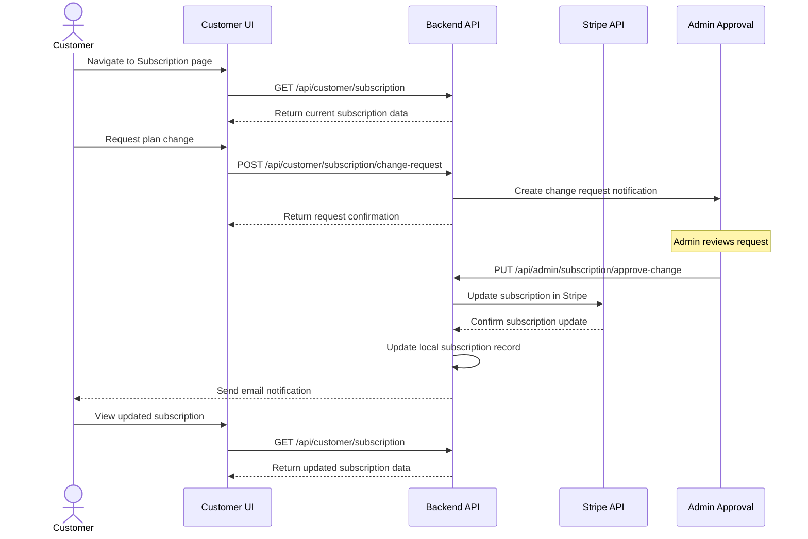
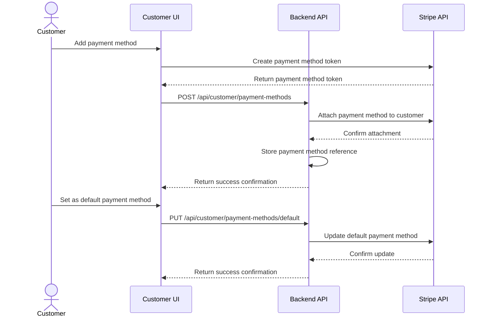
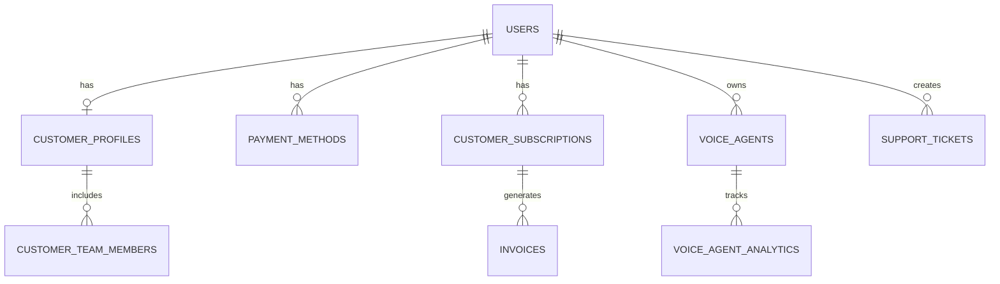

# AgenticVoice.net Customer Page Specifications

## Overview

The Customer Page serves as the primary interface for AgenticVoice.net customers to manage their accounts, subscriptions, billing information, and voice agent settings. This page is designed to provide a seamless self-service experience while maintaining the professional and sophisticated brand identity of AgenticVoice.net.

## User Personas

### Primary User: Practice Manager

- **Role**: Manages the practice's AgenticVoice account
- **Goals**: 
  - Monitor voice agent usage and performance
  - Manage subscription and billing details
  - Update practice information and settings
  - Access support resources
- **Pain Points**:
  - Limited time for administrative tasks
  - Needs clear visibility into service value and ROI
  - Requires straightforward billing management

### Secondary User: Healthcare/Legal Professional

- **Role**: Practice owner or senior professional
- **Goals**:
  - Verify service quality and effectiveness
  - Ensure HIPAA/legal compliance
  - Understand billing and subscription details
  - Make high-level configuration decisions
- **Pain Points**:
  - Limited technical expertise
  - Concerned about patient/client confidentiality
  - Needs clear metrics on service benefits

## Features and Functionality

### 1. Account Management

#### 1.1 Profile Management

- Practice/company information management
  - Name, address, phone, email
  - Business hours
  - Practice specialty/focus area
- User profile settings
  - Name, title, contact information
  - Password management
  - Two-factor authentication setup
  - Notification preferences
- Team member management (limited)
  - View team members with access
  - Request additional seats (requires admin approval)

#### 1.2 Branding Settings

- Upload practice logo
- Select color scheme preferences (within brand guidelines)
- Customize voice agent greeting and closing messages
- Voice selection options (based on subscription tier)

#### 1.3 Communication Preferences

- Email notification settings
- SMS alert configuration
- Weekly/monthly report delivery options
- Emergency contact information

### 2. Subscription Management

#### 2.1 Subscription Overview

- Current plan details
  - Plan name and description
  - Monthly/annual cost
  - Renewal date
  - Included features and limitations
- Usage statistics
  - Call minutes used/remaining
  - Number of active voice agents
  - Additional metrics based on subscription tier

#### 2.2 Plan Management

- View available plan options
- Compare current plan with alternatives
- Request plan upgrade/downgrade (requires admin approval)
- View plan change history

#### 2.3 Add-on Services

- Browse available add-on features
- Request add-on activation (requires admin approval)
- View active add-ons and their costs

### 3. Billing and Payment

#### 3.1 Stripe Integration

- Secure credit card management
  - Add/update payment methods
  - Set default payment method
  - View saved payment methods
- Automatic billing setup
- Invoice settings
  - Billing address management
  - Tax information
  - Invoice delivery preferences

#### 3.2 Billing History

- Complete invoice history
- Downloadable PDF invoices
- Payment receipt access
- Transaction details

#### 3.3 Payment Processing

- Make one-time payments
- View upcoming charges
- Manage automatic payments
- Handle failed payment recovery

### 4. Voice Agent Configuration

#### 4.1 Voice Agent Overview

- List of active voice agents
- Status indicators (active/inactive)
- Performance metrics
  - Call volume
  - Average call duration
  - Resolution rate
  - Customer satisfaction scores

#### 4.2 Basic Configuration

- Voice agent naming
- Business hours settings
- Holiday schedule management
- Call routing preferences
- Voicemail settings

#### 4.3 Script Visualization

- View current voice agent scripts
- Request script modifications (handled by AgenticVoice team)
- Preview script changes before implementation
- Script version history

### 5. Analytics and Reporting

#### 5.1 Dashboard Widgets

- Call volume trends
- Peak usage times
- Common customer inquiries
- Resolution rates
- Cost savings estimates

#### 5.2 Report Generation

- Standard report templates
  - Usage summary
  - Performance metrics
  - ROI analysis
- Custom date range selection
- Export options (PDF, CSV, Excel)
- Scheduled report delivery

### 6. Support and Resources

#### 6.1 Help Center Access

- Searchable knowledge base
- Video tutorials
- Best practices guides
- FAQ section

#### 6.2 Support Requests

- Create new support tickets
- Track existing ticket status
- View support history
- Schedule consultation calls

#### 6.3 Feature Requests

- Submit enhancement suggestions
- Vote on community feature requests
- Track request status

## User Interface Design

### Layout

- **Responsive Design**: Full functionality on all device sizes
- **Navigation**: Top navigation bar with dropdown menus
- **Sidebar**: Quick access to key features and metrics
- **Main Content Area**: Card-based layout with responsive grid
- **Footer**: Support links, legal information, version details

### Key UI Components

#### Header Components

- **Logo**: AgenticVoice.net logo with practice customization
- **Navigation Menu**: Primary navigation categories
- **Search Bar**: Global search functionality
- **Notification Bell**: System alerts and updates
- **User Profile Menu**: Quick access to profile and settings

#### Dashboard Components

- **Welcome Card**: Personalized greeting and quick stats
- **Usage Summary**: Visual representation of service usage
- **Recent Activity**: Timeline of recent interactions
- **Quick Actions**: Common tasks and shortcuts
- **Alerts**: Important notifications and required actions

#### Content Components

- **Data Cards**: For displaying metrics and information
- **Form Components**: For data entry and editing
- **Tables**: For displaying historical data and lists
- **Modal Dialogs**: For confirmations and quick actions
- **Wizards**: For multi-step processes

### Visual Design

- Follow the AgenticVoice.net design system
- Use the primary color palette for main UI elements
- Apply secondary colors for accents and highlights
- Implement consistent typography hierarchy
- Incorporate micro-interactions for better UX

## Database Schema

### Customer Profiles Table

```
customer_profiles
├── id (UUID, PK)
├── user_id (UUID, FK to users)
├── company_name (VARCHAR)
├── company_address (TEXT)
├── company_phone (VARCHAR)
├── company_email (VARCHAR)
├── business_hours (JSONB)
├── industry (VARCHAR)
├── specialty (VARCHAR)
├── logo_url (VARCHAR)
├── color_scheme (VARCHAR)
├── created_at (TIMESTAMP)
└── updated_at (TIMESTAMP)
```

### Customer Team Members Table

```
customer_team_members
├── id (UUID, PK)
├── customer_profile_id (UUID, FK to customer_profiles)
├── user_id (UUID, FK to users)
├── role (VARCHAR)
├── is_primary_contact (BOOLEAN)
├── created_at (TIMESTAMP)
└── updated_at (TIMESTAMP)
```

### Payment Methods Table

```
payment_methods
├── id (UUID, PK)
├── user_id (UUID, FK to users)
├── stripe_payment_method_id (VARCHAR)
├── card_brand (VARCHAR)
├── last_four (VARCHAR)
├── expiry_month (INTEGER)
├── expiry_year (INTEGER)
├── is_default (BOOLEAN)
├── created_at (TIMESTAMP)
└── updated_at (TIMESTAMP)
```

### Invoices Table

```
invoices
├── id (UUID, PK)
├── user_id (UUID, FK to users)
├── subscription_id (UUID, FK to customer_subscriptions)
├── stripe_invoice_id (VARCHAR)
├── amount (DECIMAL)
├── status (ENUM: draft, open, paid, uncollectible, void)
├── due_date (DATE)
├── paid_at (TIMESTAMP)
├── invoice_pdf_url (VARCHAR)
├── created_at (TIMESTAMP)
└── updated_at (TIMESTAMP)
```

### Voice Agents Table

```
voice_agents
├── id (UUID, PK)
├── user_id (UUID, FK to users)
├── name (VARCHAR)
├── vapi_assistant_id (VARCHAR)
├── status (ENUM: active, inactive, pending)
├── business_hours (JSONB)
├── voice_settings (JSONB)
├── script_version (INTEGER)
├── created_at (TIMESTAMP)
└── updated_at (TIMESTAMP)
```

### Voice Agent Analytics Table

```
voice_agent_analytics
├── id (UUID, PK)
├── voice_agent_id (UUID, FK to voice_agents)
├── date (DATE)
├── calls_handled (INTEGER)
├── avg_call_duration (INTEGER)
├── resolution_rate (DECIMAL)
├── customer_satisfaction (DECIMAL)
├── created_at (TIMESTAMP)
└── updated_at (TIMESTAMP)
```

### Support Tickets Table

```
support_tickets
├── id (UUID, PK)
├── user_id (UUID, FK to users)
├── subject (VARCHAR)
├── description (TEXT)
├── status (ENUM: open, in_progress, resolved, closed)
├── priority (ENUM: low, medium, high, urgent)
├── assigned_to (UUID, FK to admin_users)
├── created_at (TIMESTAMP)
└── updated_at (TIMESTAMP)
```

## User Flows

### Account Setup Flow

1. Customer receives welcome email with login credentials
2. Customer logs in for the first time
3. System prompts for password change
4. Customer completes profile setup wizard:
   - Company information
   - Business hours
   - Logo upload
   - Team member information
5. System confirms setup completion
6. Customer is directed to dashboard

### Subscription Management Flow

1. Customer navigates to Subscription section
2. System displays current plan details and usage
3. Customer can:
   - View plan details
   - Compare with other plans
   - Request plan changes
4. For plan change requests:
   - Customer selects desired plan
   - System shows price difference and feature changes
   - Customer confirms request
   - System notifies administrators for approval
   - Customer receives confirmation email

### Payment Method Management Flow

1. Customer navigates to Billing section
2. System displays current payment methods
3. Customer can:
   - Add new payment method
   - Set default payment method
   - Remove existing methods
4. When adding a new method:
   - Customer enters card details via Stripe Elements
   - Stripe validates and tokenizes card information
   - System stores payment method reference
   - Customer receives confirmation

### Voice Agent Configuration Flow

1. Customer navigates to Voice Agents section
2. System displays list of active voice agents
3. Customer selects a voice agent to configure
4. System shows configuration options based on subscription tier
5. Customer can modify allowed settings:
   - Business hours
   - Greeting messages
   - Voice selection
6. For script changes:
   - Customer submits change request
   - System notifies AgenticVoice team
   - AgenticVoice team implements changes
   - Customer receives notification to review
   - Customer approves or requests further changes

## Stripe Integration

### Implementation Details

1. **Stripe Elements Integration**
   - Use Stripe Elements for secure payment form
   - Implement Card Element for credit card input
   - Support for Apple Pay and Google Pay where available

2. **Customer Portal Integration**
   - Leverage Stripe Customer Portal for subscription management
   - Customize portal branding to match AgenticVoice.net
   - Configure available actions (update payment, download invoices)

3. **Webhook Implementation**
   - Set up Stripe webhooks to handle events:
     - `invoice.payment_succeeded`
     - `invoice.payment_failed`
     - `customer.subscription.updated`
     - `customer.subscription.deleted`
   - Update local database based on webhook events

4. **Invoice Management**
   - Generate and store invoices in Stripe
   - Provide downloadable PDF invoices
   - Send automated invoice emails

### Security Considerations

- PCI compliance through Stripe Elements
- No storage of credit card details on AgenticVoice servers
- Secure webhook signature verification
- HTTPS for all communications
- Proper API key management

## Error Handling

- Form validation with clear error messages
- Graceful handling of Stripe API errors
- Fallback options for failed payments
- Clear notification system for issues requiring attention
- Automatic retry logic for transient failures

## Accessibility Considerations

- WCAG 2.1 AA compliance
- Keyboard navigation support
- Screen reader compatibility
- Sufficient color contrast
- Focus management for modal dialogs
- Responsive design for all device sizes

## Multilingual Support

- Interface translation for key languages:
  - English (default)
  - Spanish
  - French
  - German
  - Chinese (Simplified)
- Date, time, and currency localization
- Right-to-left (RTL) language support

## Mobile Responsiveness

- Fully responsive design for all screen sizes
- Touch-optimized interface elements
- Simplified navigation on smaller screens
- Optimized forms for mobile input
- Native app-like experience on mobile devices

## Implementation Notes

- Use Next.js for server-side rendering and improved SEO
- Implement proper state management for complex forms
- Use optimistic UI updates for better perceived performance
- Implement proper error boundaries to prevent cascading failures
- Use WebSockets for real-time updates where appropriate

## Mermaid Diagrams

### Customer Page Structure

```mermaid
graph TD
    A[Customer Dashboard] --> B[Account Management]
    A --> C[Subscription & Billing]
    A --> D[Voice Agent Configuration]
    A --> E[Analytics & Reporting]
    A --> F[Support & Resources]
    
    B --> B1[Profile Settings]
    B --> B2[Team Management]
    B --> B3[Branding Settings]
    B --> B4[Communication Preferences]
    
    C --> C1[Subscription Overview]
    C --> C2[Plan Management]
    C --> C3[Payment Methods]
    C --> C4[Billing History]
    
    D --> D1[Voice Agent List]
    D --> D2[Configuration Settings]
    D --> D3[Script Management]
    D --> D4[Schedule Settings]
    
    E --> E1[Performance Dashboard]
    E --> E2[Call Analytics]
    E --> E3[ROI Metrics]
    E --> E4[Custom Reports]
    
    F --> F1[Knowledge Base]
    F --> F2[Support Tickets]
    F --> F3[Feature Requests]
    F --> F4[Scheduled Consultations]
```



### Subscription Management Flow



### Payment Processing Flow



### Database Relationship Diagram


