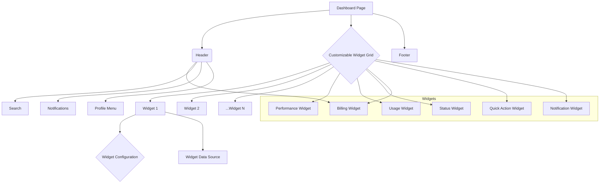
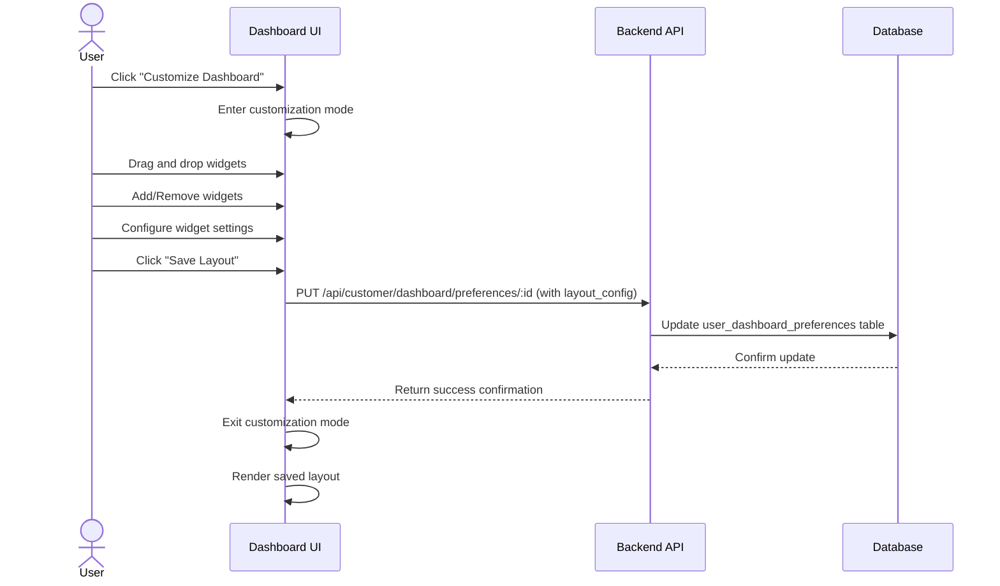

# AgenticVoice.net Dashboard Page Specifications

## Overview

The Dashboard Page serves as the central hub for customers to monitor their voice agent performance, manage configurations, and access key features of the AgenticVoice.net platform. It provides a personalized and configurable overview of the customer's account activity, usage metrics, and agent settings. The dashboard is designed to be intuitive, visually appealing, and fully responsive across all devices, adhering to the established brand identity and design system.

## User Personas

### Primary User: Practice Manager

- **Role**: Manages the practice's AgenticVoice account
- **Goals**: 
  - Get a quick overview of voice agent performance
  - Monitor call volume and usage trends
  - Access key configuration settings easily
  - Stay informed about important alerts and notifications
- **Pain Points**:
  - Needs a consolidated view of key information
  - Requires customizable views to focus on relevant metrics
  - Wants quick access to frequently used features

### Secondary User: Healthcare/Legal Professional

- **Role**: Practice owner or senior professional
- **Goals**:
  - Understand the overall impact of the service
  - View high-level performance metrics
  - Ensure the service is operating effectively
- **Pain Points**:
  - Prefers a simple, easy-to-understand interface
  - Needs key performance indicators (KPIs) readily available

## Features and Functionality

### 1. Customizable Dashboard Layout

- **Widget-Based System**: The dashboard is composed of configurable widgets that users can add, remove, resize, and rearrange.
- **Drag-and-Drop Interface**: Intuitive interface for customizing the layout.
- **Multiple Dashboard Views**: Ability to create and save different dashboard layouts for various purposes (e.g., Performance Overview, Billing Summary, Agent Configuration).
- **Default Layouts**: Pre-configured dashboard layouts based on user roles or common use cases.

### 2. Available Widgets

#### 2.1 Performance Widgets

- **Total Calls Handled**: Displays total calls handled over a selected period (day, week, month).
- **Average Call Duration**: Shows the average duration of calls.
- **Resolution Rate**: Tracks the percentage of calls successfully resolved by the agent.
- **Customer Satisfaction**: Displays aggregated satisfaction scores (if collected).
- **Call Volume Trend**: Line chart showing call volume over time.
- **Peak Usage Times**: Heatmap or bar chart indicating busiest hours/days.
- **Cost Savings Estimate**: Calculates estimated savings based on call volume and agent efficiency.

#### 2.2 Usage Widgets

- **Current Call Minutes**: Displays minutes used against the plan limit.
- **Active Agents**: Shows the number of currently active voice agents.
- **API Usage**: Tracks API call consumption (if applicable).
- **Subscription Overview**: Quick view of the current plan and renewal date.

#### 2.3 Agent Status Widgets

- **Agent Health**: Displays the operational status of each voice agent.
- **Recent Agent Activity**: Log of recent significant actions or events related to agents.
- **Configuration Summary**: Quick links to key agent configuration settings.

#### 2.4 Billing Widgets

- **Current Balance**: Shows the current account balance or upcoming charges.
- **Next Invoice Date**: Displays the date of the next scheduled invoice.
- **Recent Invoices**: List of recent invoices with status and download links.

#### 2.5 Quick Action Widgets

- **Start Demo Call**: Button to initiate a test call with an agent.
- **View Recent Calls**: Link to detailed call logs.
- **Manage Agents**: Link to the voice agent configuration page.
- **Create Support Ticket**: Quick access to the support system.

#### 2.6 Notification Widget

- **Unified Notification Center**: Displays system alerts, billing notifications, and important updates.
- **Filtering Options**: Filter notifications by type or severity.
- **Mark as Read/Dismiss**: Ability to manage notifications.

### 3. Configuration Options

#### 3.1 Dashboard Settings

- **Add/Remove Widgets**: Interface to select which widgets appear on the dashboard.
- **Layout Management**: Save, load, and reset dashboard layouts.
- **Widget Configuration**: Some widgets may have specific settings (e.g., date range for charts, specific agents to monitor).
- **Theme Selection**: Allow users to switch between light and dark modes.

#### 3.2 Data Refresh Rate

- Option to configure how frequently dashboard data is updated (e.g., every 5 minutes, 15 minutes, hourly).
- Manual refresh button.

#### 3.3 Default Date Range

- Set the default time period for performance and usage widgets (e.g., Last 7 Days, Last 30 Days, Month to Date).

### 4. Mobile Responsiveness

- **Adaptive Layout**: The dashboard layout automatically adjusts for different screen sizes.
- **Single-Column View**: On smaller screens, widgets stack vertically.
- **Touch Optimization**: Larger touch targets and swipe gestures for navigation.
- **Prioritized Content**: Key information is displayed prominently on mobile views.
- **Performance Optimization**: Efficient loading and rendering on mobile devices.

### 5. Multilingual Support

- **Language Selection**: User preference setting for interface language.
- **Supported Languages**: English (default), Spanish, French, German, Chinese (Simplified).
- **Localized Content**: All UI text, labels, and system messages are translated.
- **Date/Time/Number Formatting**: Automatic localization based on selected language/region.
- **RTL Support**: Proper layout adjustments for right-to-left languages.

## User Interface Design

### Layout

- **Grid System**: Flexible grid layout allowing for widget resizing and rearrangement.
- **Header**: Persistent header with navigation, search, notifications, and profile access.
- **Widget Containers**: Standardized card design for all widgets, following the design system.
- **Spacing**: Consistent padding and margins between widgets and sections.

### Key UI Components

- **Widget Cards**: Standardized container with header (title, actions like configure/remove) and content area.
- **Charts**: Utilize libraries like Chart.js or Recharts, styled according to the design system.
- **Data Displays**: Clear presentation of numbers, percentages, and trends.
- **Configuration Modal**: Dialog for adding/removing widgets and managing layouts.
- **Dropdowns/Selects**: For choosing date ranges, agents, or other filter options.
- **Loading Skeletons**: Shimmer effects (MagicUI) while widgets load data.

### Visual Design

- Adherence to the AgenticVoice.net brand identity and design system.
- Use of primary and secondary color palettes for visual hierarchy and emphasis.
- Clear typography for readability.
- Subtle animations (MagicUI) for loading states, data updates, and interactions.
- Consistent iconography (Heroicons).

## Database Schema (Relevant Additions/Considerations)

### User Dashboard Preferences Table

```
user_dashboard_preferences
├── id (UUID, PK)
├── user_id (UUID, FK to users)
├── dashboard_name (VARCHAR, default: 'Default')
├── layout_config (JSONB) -- Stores widget positions, sizes, and configurations
├── is_default (BOOLEAN)
├── created_at (TIMESTAMP)
└── updated_at (TIMESTAMP)
```

### Widget Configurations Table (Optional - if widgets have complex, reusable settings)

```
widget_configurations
├── id (UUID, PK)
├── user_id (UUID, FK to users)
├── widget_type (VARCHAR)
├── configuration_name (VARCHAR)
├── settings (JSONB) -- Specific settings for the widget instance
├── created_at (TIMESTAMP)
└── updated_at (TIMESTAMP)
```

## User Flows

### Dashboard Customization Flow

1. User clicks "Customize Dashboard" or similar button.
2. UI enters customization mode (e.g., widgets become draggable, add/remove options appear).
3. User can:
   - Drag widgets to rearrange.
   - Resize widgets (if supported).
   - Click "Add Widget" to open a modal/panel listing available widgets.
   - Select widgets to add.
   - Click configure icon on a widget to adjust its specific settings.
   - Click remove icon on a widget to delete it.
4. User clicks "Save Layout".
5. System saves the `layout_config` to the `user_dashboard_preferences` table.
6. UI exits customization mode and reflects the saved layout.

### Switching Dashboard Views Flow

1. User clicks on a dropdown or tab selector for dashboard views.
2. System displays saved dashboard layouts.
3. User selects a different layout.
4. System retrieves the corresponding `layout_config` from `user_dashboard_preferences`.
5. UI updates to display the selected dashboard layout.

## API Endpoints (Relevant Additions)

- `GET /api/customer/dashboard/preferences` - Get all saved dashboard preferences for the user.
- `GET /api/customer/dashboard/preferences/:id` - Get a specific dashboard layout configuration.
- `POST /api/customer/dashboard/preferences` - Create a new dashboard layout.
- `PUT /api/customer/dashboard/preferences/:id` - Update an existing dashboard layout.
- `DELETE /api/customer/dashboard/preferences/:id` - Delete a dashboard layout.
- `PUT /api/customer/dashboard/preferences/:id/default` - Set a layout as the default.
- `GET /api/customer/dashboard/widgets/:widget_type` - Endpoint to fetch data specifically for a widget type (e.g., `/api/customer/dashboard/widgets/call-volume?range=30d`).

## Error Handling

- Graceful handling if a widget fails to load data (e.g., display error message within the widget).
- Clear feedback during layout saving/loading operations.
- Validation for widget configurations.

## Accessibility Considerations

- Keyboard navigation for rearranging widgets and accessing widget controls.
- ARIA attributes for drag-and-drop functionality.
- Screen reader announcements for data updates and notifications.
- High contrast themes available.
- Charts and graphs should have accessible alternatives or descriptions.

## Implementation Notes

- Consider using a library like `react-grid-layout` for the customizable grid system.
- Implement efficient data fetching strategies to avoid overwhelming the backend, possibly using batch requests or WebSockets for real-time updates.
- Cache widget data where appropriate.
- Ensure smooth performance, especially during layout customization.

## Mermaid Diagrams

### Dashboard Structure



### Dashboard Customization Flow


