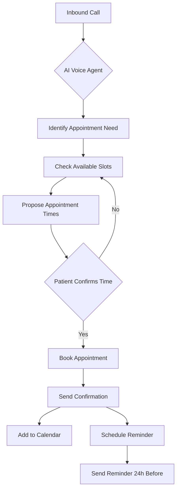
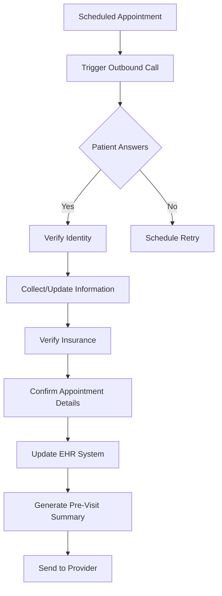
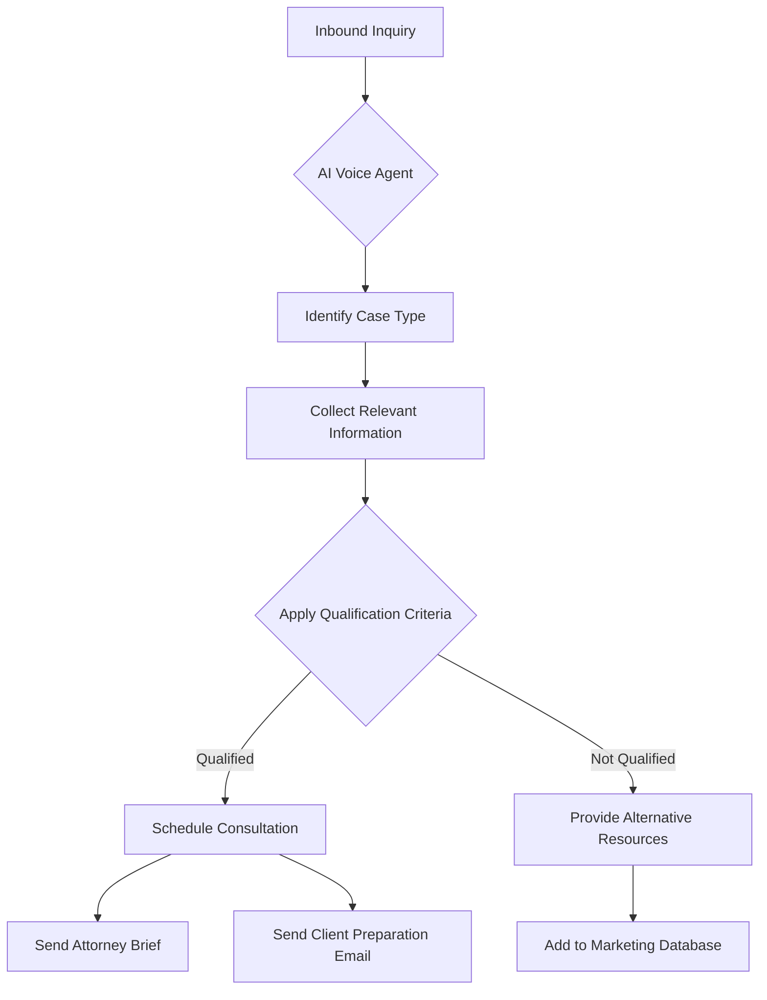
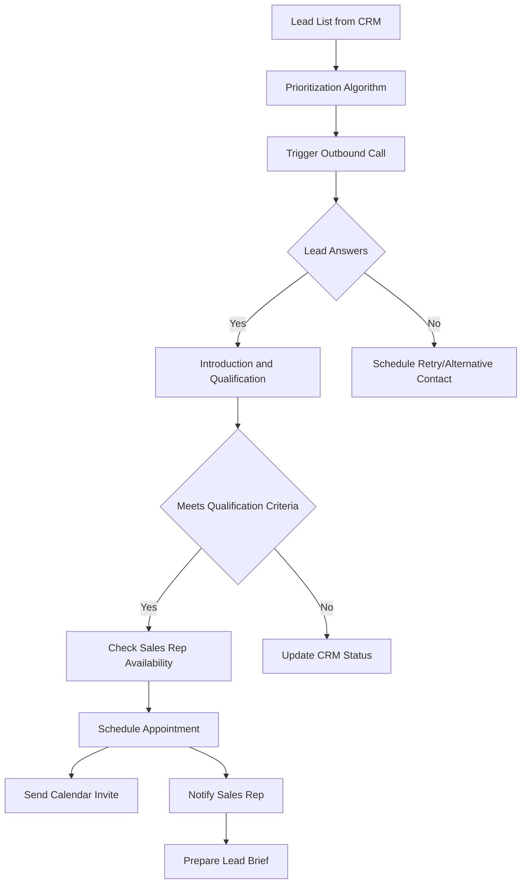
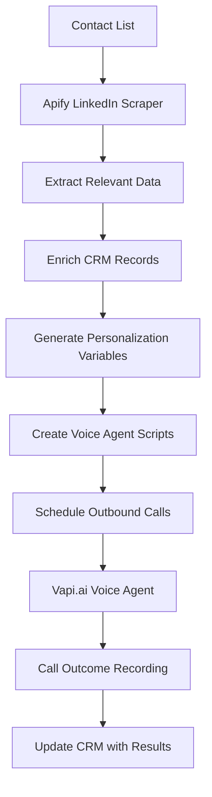
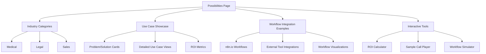
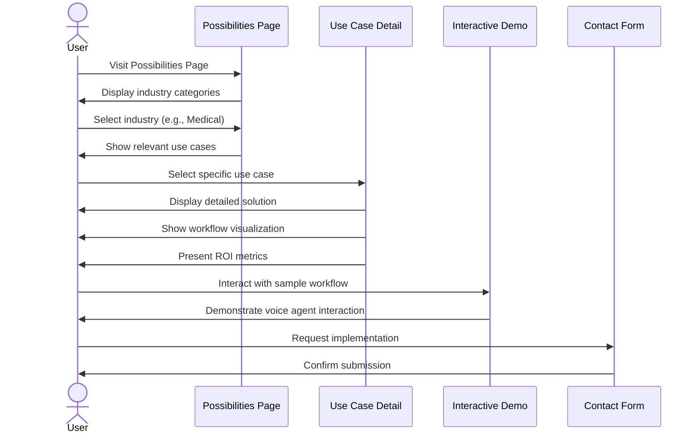
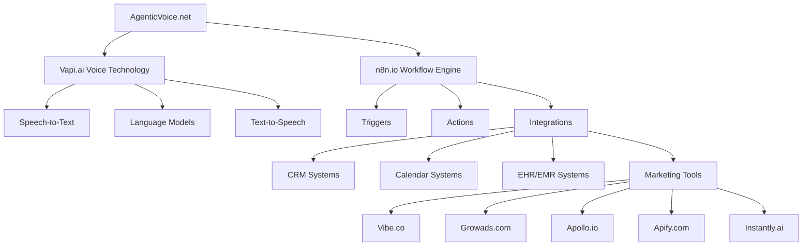

# AgenticVoice.net Possibilities Page Specifications

## Overview

The Possibilities Page serves as an inspirational and educational resource that showcases the potential applications and integrations of AgenticVoice.net's AI voice agents. This page focuses specifically on demonstrating the powerful combination of Vapi.ai's voice technology with n8n.io workflows, illustrating how these integrations can solve real-world problems for medical practices, legal firms, and sales organizations. The page is designed to help customers envision what's possible with the platform and inspire them to implement similar solutions for their specific needs.

## User Personas

### Primary User: Practice Decision Maker

- **Role**: Owner or senior decision maker at a medical practice, legal firm, or sales organization
- **Goals**: 
  - Understand the full potential of AgenticVoice.net
  - Discover specific use cases relevant to their industry
  - Visualize how voice agents could transform their operations
  - Identify high-value implementation opportunities
- **Pain Points**:
  - May struggle to envision abstract technical capabilities
  - Needs concrete examples tied to business outcomes
  - Requires clear ROI justification

### Secondary User: Practice Manager

- **Role**: Day-to-day manager of practice operations
- **Goals**: 
  - Find solutions to specific operational challenges
  - Understand how voice agents integrate with existing workflows
  - Identify opportunities for process improvement
- **Pain Points**:
  - Concerned about implementation complexity
  - Needs to understand how solutions fit into existing processes
  - Wants to see practical, ready-to-use examples

## Features and Functionality

### 1. Use Case Showcase

#### 1.1 Industry-Specific Use Case Categories

- **Medical Practice Use Cases**
  - Appointment scheduling and management
  - Patient intake and information collection
  - Prescription refill requests
  - Insurance verification
  - Post-visit follow-ups
  - Patient satisfaction surveys

- **Legal Practice Use Cases**
  - Client intake and qualification
  - Appointment scheduling
  - Document request handling
  - Case status updates
  - Client follow-ups
  - Billing inquiries

- **Sales Organization Use Cases**
  - Lead qualification
  - Appointment setting
  - Product information delivery
  - Follow-up scheduling
  - Customer satisfaction surveys
  - Order status inquiries

#### 1.2 Use Case Detail View

Each use case should include:

- **Problem Statement**: Clear description of the business challenge
- **Solution Overview**: How AgenticVoice.net addresses the problem
- **Implementation Approach**: High-level description of the solution components
- **Key Benefits**: Specific outcomes and advantages
- **ROI Metrics**: Quantifiable benefits (time saved, cost reduction, etc.)
- **Visual Workflow**: Interactive diagram showing how the solution works
- **Sample Conversation**: Example dialogue between the voice agent and a caller

### 2. n8n.io Workflow Integration Showcase

#### 2.1 Workflow Categories

- **Data Collection Workflows**
  - Patient/client information gathering
  - Survey and feedback collection
  - Form completion assistance

- **Integration Workflows**
  - EHR/EMR system integration
  - CRM integration (Salesforce, HubSpot, etc.)
  - Calendar system integration (Google Calendar, Outlook)
  - Practice management software integration

- **Automation Workflows**
  - Appointment reminder sequences
  - Follow-up communication chains
  - Document preparation and delivery
  - Multi-step intake processes

- **Analytics Workflows**
  - Call data aggregation and reporting
  - Sentiment analysis
  - Conversion tracking
  - Performance monitoring

#### 2.2 Workflow Detail View

Each workflow showcase should include:

- **Workflow Purpose**: Clear description of what the workflow accomplishes
- **Components Used**: List of n8n.io nodes and integrations utilized
- **Visual Workflow Diagram**: Interactive n8n.io workflow visualization
- **Configuration Guide**: High-level overview of setup requirements
- **Integration Points**: How the workflow connects with Vapi.ai
- **Expected Outcomes**: What results the workflow produces
- **Customization Options**: How the workflow can be adapted

### 3. External Integration Showcase

#### 3.1 Marketing and Sales Tool Integrations

Demonstrate integrations with tools mentioned by the client:
- **Vibe.co**: Social media content creation and management
- **Growads.com**: Digital advertising automation
- **Apollo.io**: Sales intelligence and engagement
- **Apify.com**: Web scraping and data extraction
- **Instantly.ai**: Email outreach automation

#### 3.2 Industry-Specific Integrations

- **Medical**: Epic, Cerner, Allscripts, athenahealth
- **Legal**: Clio, MyCase, PracticePanther, LexisNexis
- **Sales**: Salesforce, HubSpot, Pipedrive, Zoho CRM

### 4. Interactive Demonstrations

#### 4.1 Workflow Visualizer

- Interactive tool that visually demonstrates how data flows between systems
- Animated process flows showing voice agent interactions with other systems
- Step-by-step walkthrough capability

#### 4.2 ROI Calculator

- Interactive calculator that estimates potential savings and benefits
- Customizable inputs based on practice size, call volume, etc.
- Comparative analysis of before/after implementation

#### 4.3 Sample Call Simulator

- Audio examples of voice agent handling different scenarios
- Interactive demo allowing users to choose different conversation paths
- Before/after comparison of manual vs. automated processes

## User Interface Design

### Layout

- **Hero Section**: Engaging introduction with key value proposition
- **Category Navigation**: Easy filtering of use cases by industry and function
- **Card Grid**: Visual display of available use cases and workflows
- **Detail View**: Expanded information when a specific item is selected
- **Interactive Tools**: Prominent placement of simulators and calculators

### Key UI Components

- **Use Case Cards**: Visual representations of each use case with icon, title, and brief description
- **Workflow Diagrams**: Interactive visualizations using mermaid.js
- **Demo Players**: Audio/video players for sample interactions
- **Tabbed Interfaces**: For organizing different categories of content
- **Interactive Calculators**: For ROI estimation and benefit analysis
- **Comparison Tables**: For before/after scenarios

### Visual Design

- Follow the AgenticVoice.net design system
- Use the primary color palette for main UI elements
- Apply secondary colors for accents and category differentiation
- Implement consistent typography hierarchy
- Incorporate micro-interactions for better engagement

## Content Requirements

### 1. Medical Practice Use Case Examples

#### 1.1 Automated Appointment Scheduling

**Problem Statement**: Medical practices spend significant staff time scheduling, confirming, and rescheduling appointments, leading to high administrative costs and potential scheduling errors.

**Solution Overview**: An AI voice agent that handles inbound calls for appointment scheduling, integrates with the practice's calendar system, and follows specific scheduling rules.

**Implementation Approach**:
- Vapi.ai voice agent with medical scheduling prompt engineering
- n8n.io workflow connecting to Google Calendar/Office 365
- Integration with practice management software
- SMS/email confirmation system

**Key Benefits**:
- 24/7 appointment scheduling capability
- Reduced administrative staff workload
- Decreased no-show rates through automated reminders
- Improved patient satisfaction with immediate service

**ROI Metrics**:
- 15-20 hours of staff time saved weekly
- 30% reduction in no-show rates
- $2,000-$3,000 monthly savings in administrative costs

**Visual Workflow**:


**Sample Conversation**:
```
Agent: "Thank you for calling Westside Medical Group. This is Maya, your virtual assistant. How can I help you today?"

Caller: "I need to schedule an appointment with Dr. Johnson."

Agent: "I'd be happy to help you schedule with Dr. Johnson. May I have your name and date of birth to locate your record?"

Caller: "Jane Smith, January 15, 1980."

Agent: "Thank you, Jane. I see you're an established patient with Dr. Johnson. What's the reason for your visit?"

Caller: "I need my annual physical."

Agent: "I understand you need to schedule your annual physical with Dr. Johnson. Dr. Johnson has availability on Tuesday, June 3rd at 10:00 AM or Thursday, June 5th at 2:30 PM. Would either of those work for you?"

Caller: "Thursday at 2:30 works better."

Agent: "Great! I've scheduled you for Thursday, June 5th at 2:30 PM with Dr. Johnson for your annual physical. You'll receive a confirmation email shortly, and a reminder text message 24 hours before your appointment. Is there anything else I can help you with today?"
```

#### 1.2 Patient Intake Automation

**Problem Statement**: Collecting patient information before appointments is time-consuming and often results in incomplete data, creating inefficiencies during visits.

**Solution Overview**: An AI voice agent that proactively calls patients before appointments to collect necessary information and update electronic health records.

**Implementation Approach**:
- Vapi.ai outbound calling capability
- n8n.io workflow for triggering calls based on appointment schedule
- Integration with EHR/EMR system
- HIPAA-compliant data handling

**Key Benefits**:
- Complete patient information before appointments
- Reduced waiting room paperwork
- More efficient appointment time utilization
- Improved data accuracy

**ROI Metrics**:
- 5-10 minutes saved per patient appointment
- 40% reduction in incomplete patient records
- Increased appointment capacity by 15%

**Visual Workflow**:


### 2. Legal Practice Use Case Examples

#### 2.1 Client Intake and Case Qualification

**Problem Statement**: Law firms lose potential clients due to delayed response times and inefficient initial screening processes.

**Solution Overview**: An AI voice agent that handles inbound inquiry calls, collects preliminary case information, and qualifies potential clients based on firm-specific criteria.

**Implementation Approach**:
- Vapi.ai voice agent with legal intake prompt engineering
- n8n.io workflow for case qualification logic
- Integration with legal CRM system
- Automated follow-up system

**Key Benefits**:
- 24/7 response to potential client inquiries
- Consistent qualification process
- Immediate scheduling for qualified prospects
- Detailed information collection before attorney involvement

**ROI Metrics**:
- 35% increase in qualified lead conversion
- 60% reduction in time from inquiry to consultation
- $5,000-$10,000 monthly increase in billable consultations

**Visual Workflow**:


### 3. Sales Organization Use Case Examples

#### 3.1 Automated Lead Qualification and Appointment Setting

**Problem Statement**: Sales teams waste valuable time on unqualified leads and repetitive outreach tasks.

**Solution Overview**: An AI voice agent that conducts outbound calls to leads, qualifies them based on specific criteria, and schedules appointments for sales representatives.

**Implementation Approach**:
- Vapi.ai outbound calling capability
- n8n.io workflow integrated with CRM for lead prioritization
- Calendar integration for sales rep availability
- Lead scoring and routing logic

**Key Benefits**:
- Increased contact rate with leads
- Consistent qualification process
- Sales reps focus only on qualified opportunities
- Detailed lead information before sales conversations

**ROI Metrics**:
- 3x increase in qualified appointments set
- 40% reduction in cost per qualified lead
- 25% increase in sales rep productivity

**Visual Workflow**:


### 4. Integration Workflow Examples

#### 4.1 LinkedIn Data Enrichment Workflow

**Problem Statement**: Sales and recruiting teams need up-to-date information about prospects and candidates, but manual research is time-consuming.

**Solution Overview**: A workflow that uses Apify.com to scrape LinkedIn data, enriches contact records, and prepares personalized outreach scripts for voice agents.

**Implementation Approach**:
- Apify.com LinkedIn scraper integration
- n8n.io workflow for data processing and enrichment
- CRM data update automation
- Personalized script generation for Vapi.ai

**Key Benefits**:
- Enriched contact data without manual research
- Highly personalized outreach conversations
- Improved connection and response rates
- Time savings for sales and recruiting teams

**Visual Workflow**:


## Implementation Notes

- All workflow visualizations should be interactive, allowing users to explore each step
- Use cases should be regularly updated based on customer feedback and success stories
- Consider implementing a "request custom workflow" feature for specific needs
- Ensure all examples adhere to relevant compliance requirements (HIPAA, etc.)
- Include clear calls-to-action for users to request implementation of showcased solutions

## Mermaid Diagrams

### Possibilities Page Structure



### User Journey Through Possibilities Page



### Integration Ecosystem Visualization


