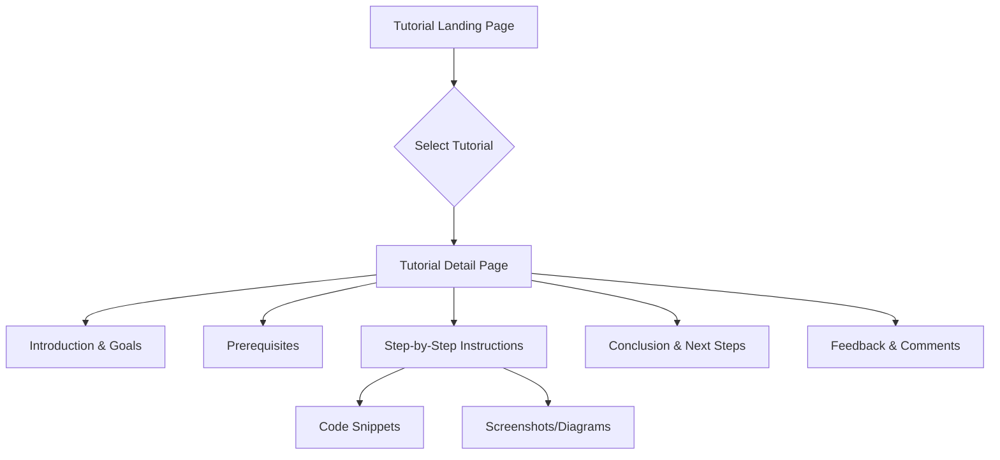

# AgenticVoice.net Resources & Tutorials Page Specifications

## Overview

The Resources & Tutorials Page serves as the primary educational hub for AgenticVoice.net users. Its purpose is to empower customers and potential users by providing comprehensive guides, step-by-step tutorials, best practices, and other learning materials. A key focus of this section is to demonstrate how to effectively leverage the combination of Vapi.ai, advanced language models like Claude 4, and automation platforms such as n8n.io to build powerful and customized voice agent solutions. The page aims to be a valuable self-service resource that enhances user proficiency and maximizes the value derived from the AgenticVoice.net platform.

## User Personas

### Primary User: Technical Implementer / Practice Manager

- **Role**: Responsible for setting up, configuring, or overseeing the technical aspects of AgenticVoice.net within their organization.
- **Goals**: 
  - Learn how to configure and customize voice agents.
  - Understand how to integrate AgenticVoice.net with other systems using n8n.io.
  - Find solutions to specific technical challenges.
  - Master advanced features and capabilities.
- **Pain Points**:
  - May have varying levels of technical expertise.
  - Needs clear, step-by-step instructions.
  - Requires practical examples relevant to their industry.

### Secondary User: Practice Decision Maker

- **Role**: Evaluates the platform's capabilities and potential.
- **Goals**: 
  - Understand the technical feasibility of desired solutions.
  - Gauge the level of effort required for implementation.
  - Assess the platform's flexibility and integration potential.
- **Pain Points**:
  - Needs high-level overviews and conceptual understanding.
  - Wants to see evidence of platform power and ease of use.

## Features and Functionality

### 1. Content Organization

#### 1.1 Categorization

- **Getting Started**: Initial setup guides, platform overview, basic concepts.
- **Vapi.ai Configuration**: Tutorials on setting up assistants, models (STT, LLM, TTS), prompts, and call handling.
- **n8n.io Integration**: Guides on connecting Vapi to n8n, building workflows, using specific nodes.
- **LLM Usage (Claude 4 Focus)**: Prompt engineering techniques, using Claude 4 for specific tasks within Vapi.
- **Integrations**: Tutorials on connecting with specific CRMs, EHRs, Calendar systems, etc.
- **Use Case Implementation**: Step-by-step guides for building solutions showcased on the Possibilities Page.
- **Best Practices**: Security, compliance, performance optimization, prompt design.
- **API & SDK Reference**: Links to relevant technical documentation.

#### 1.2 Content Types

- **Tutorials**: Step-by-step guides with code snippets and screenshots.
- **Guides**: Conceptual explanations and best practice documents.
- **Video Library**: Embedded video tutorials and walkthroughs.
- **Code Snippets**: Reusable code examples for common tasks.
- **Glossary**: Definitions of key terms and concepts.
- **FAQ**: Answers to frequently asked questions.

### 2. Search and Filtering

- **Robust Search Bar**: Full-text search across all resources.
- **Filtering Options**: 
  - By Category (as listed above)
  - By Content Type (Tutorial, Video, Guide, etc.)
  - By Difficulty Level (Beginner, Intermediate, Advanced)
  - By Technology (Vapi, n8n, Claude 4, Specific Integration)
  - By Industry (Medical, Legal, Sales)
- **Tagging System**: Keywords associated with each resource for better discoverability.

### 3. Content Presentation

- **Rich Text Formatting**: Support for headings, lists, bold/italic text, links.
- **Code Block Highlighting**: Syntax highlighting for various languages (JavaScript, JSON, Python, etc.).
- **Image and Video Embedding**: Seamless integration of visual aids.
- **Interactive Elements**: Embedded workflow diagrams (Mermaid.js), potentially interactive code examples.
- **Downloadable Assets**: Option to download code snippets, workflow templates, or configuration files.
- **Table of Contents**: Automatic generation for longer articles and tutorials.
- **Related Resources**: Links to other relevant tutorials or guides at the end of each article.

### 4. User Interaction

- **Feedback Mechanism**: Rating system (e.g., 1-5 stars) for each resource.
- **Commenting System**: Allow users to ask questions and share insights on tutorials (moderated).
- **Progress Tracking (Optional)**: For logged-in users, track completed tutorials or saved resources.
- **Social Sharing**: Buttons to share resources on social media or via email.

## User Interface Design

### Layout

- **Main Landing Page**: Features prominent search bar, category browsing, featured tutorials, and recently added content.
- **Category Pages**: Grid or list view of resources within a specific category, with filtering options.
- **Resource Detail Page**: Clean, readable layout for articles/tutorials with sidebar navigation (Table of Contents, related resources).
- **Video Library Page**: Grid layout of video thumbnails with search and filtering.

### Key UI Components

- **Resource Cards**: Display title, brief description, category, difficulty level, and content type.
- **Search Input with Filters**: Combined search and filtering component.
- **Code Blocks**: Styled component for displaying code with copy-to-clipboard functionality.
- **Video Player**: Embedded video player with standard controls.
- **Feedback Widgets**: Star rating and comment section components.
- **Pagination**: For browsing long lists of resources.

### Visual Design

- Adherence to the AgenticVoice.net brand identity and design system.
- Clear visual hierarchy for text content.
- Use of icons and illustrations to enhance understanding.
- Consistent styling for code blocks, callouts, and warnings.
- Responsive design ensuring readability and usability on all devices.

## Content Examples: Claude 4 + n8n Tutorials

### Tutorial 1: Building a Smart Appointment Scheduler with Vapi, Claude 4, and n8n

- **Introduction**: Overview of the goal – creating a voice agent that intelligently schedules appointments based on complex criteria using Claude 4's reasoning and n8n's automation.
- **Prerequisites**: Active AgenticVoice.net account, Vapi API key, n8n instance setup, Calendar API access (Google/Outlook).
- **Step 1: Configuring the Vapi Assistant**: Setting up the Vapi assistant, selecting Claude 4 as the LLM, basic prompt structure.
- **Step 2: Designing the Claude 4 Prompt**: Crafting a detailed prompt for Claude 4 to handle scheduling logic, understand constraints (doctor availability, appointment types, patient history), and extract key information.
- **Step 3: Setting up the n8n Webhook**: Creating an n8n workflow triggered by Vapi function calls or webhooks.
- **Step 4: Integrating with Calendar API**: Using n8n nodes to check calendar availability based on parameters extracted by Claude 4.
- **Step 5: Implementing Scheduling Logic in n8n**: Building the workflow to handle successful scheduling, conflicts, and proposing alternative times.
- **Step 6: Sending Confirmation Back to Vapi**: Using n8n to send results back to the Vapi assistant to communicate with the caller.
- **Step 7: Handling Edge Cases and Errors**: Adding error handling in the n8n workflow.
- **Conclusion**: Summary of the built solution and potential extensions.
- **Code Snippets**: Example Claude 4 prompts, n8n workflow JSON, Vapi function call definitions.
- **Visual Workflow**: Mermaid diagram of the n8n workflow.

### Tutorial 2: Automating Client Intake for Law Firms using Vapi, Claude 4, and n8n

- **Introduction**: Goal – creating a voice agent that conducts initial client intake interviews, uses Claude 4 to summarize the case, and pushes data to a CRM via n8n.
- **Prerequisites**: AgenticVoice.net account, Vapi API key, n8n instance, CRM access (e.g., Clio, Salesforce).
- **Step 1: Vapi Assistant Setup**: Configuring the assistant with Claude 4, designing the initial conversation flow.
- **Step 2: Claude 4 Prompt for Intake**: Creating a prompt that guides Claude 4 to ask relevant intake questions based on case type and summarize the conversation effectively.
- **Step 3: n8n Workflow Trigger**: Setting up the n8n workflow to receive the call transcript and Claude 4's summary from Vapi.
- **Step 4: Data Extraction in n8n**: Using n8n nodes (e.g., Code node with JavaScript) to parse the summary and extract key data points (client name, case type, key dates, etc.).
- **Step 5: CRM Integration**: Using n8n CRM nodes to create or update client records and case files.
- **Step 6: Automated Follow-up**: Configuring n8n to trigger follow-up tasks (e.g., send welcome email, assign task to paralegal).
- **Step 7: Testing and Refinement**: How to test the flow and refine the Claude 4 prompt based on results.
- **Conclusion**: Recap of the automated intake process and its benefits.
- **Code Snippets**: Example Claude 4 summarization prompts, n8n data extraction code, CRM node configurations.
- **Visual Workflow**: Mermaid diagram illustrating the data flow from Vapi to n8n to CRM.

## Implementation Notes

- Content should be written clearly and concisely, targeting the specified user personas.
- Regularly update content to reflect platform changes and new features.
- Consider creating a content calendar for releasing new resources.
- Leverage analytics to understand which resources are most popular and identify content gaps.
- Ensure all tutorials involving sensitive data include warnings and best practices for security and compliance.

## Mermaid Diagrams

### Resources Page Structure

```mermaid
graph TD
    A[Resources & Tutorials Page] --> B[Search & Filtering]
    A --> C[Content Categories]
    A --> D[Featured Content]
    A --> E[Resource Listing]
    
    C --> C1[Getting Started]
    C --> C2[Vapi Config]
    C --> C3[n8n Integration]
    C --> C4[LLM Usage]
    C --> C5[Integrations]
    C --> C6[Use Cases]
    C --> C7[Best Practices]
    
    E --> R1[Resource Card 1]
    E --> R2[Resource Card 2]
    E --> RN[...Resource Card N]
    
    R1 --> DP[Detail Page]
    DP --> T[Title]
    DP --> TOC[Table of Contents]
    DP --> CT[Content Body]
    DP --> V[Visuals (Images/Videos)]
    DP --> CS[Code Snippets]
    DP --> FB[Feedback Section]
    DP --> RR[Related Resources]
```

### Tutorial Content Flow


