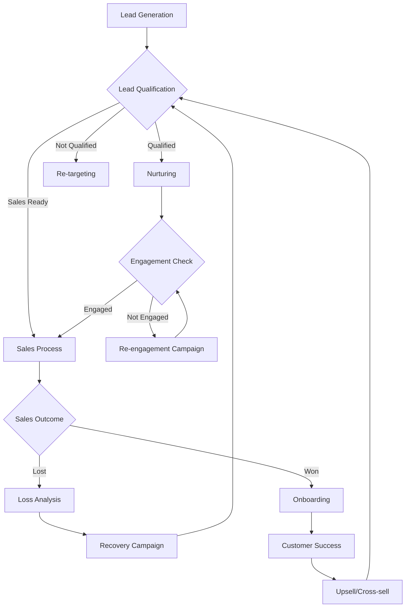
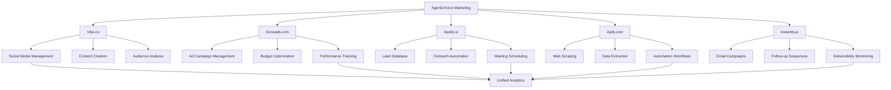
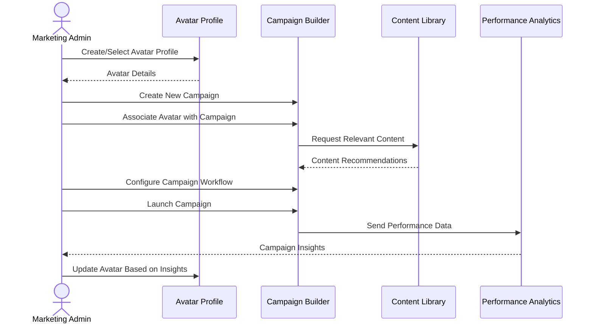

# AgenticVoice.net Marketing Page Specifications

## Overview

The Marketing Page serves as a specialized administrative interface for AgenticVoice.net team members with marketing or administrative roles. Unlike customer-facing pages, this section provides powerful tools for managing marketing campaigns, sales workflows, avatar development, and integrations with third-party marketing and sales tools. The page is designed to streamline the process of acquiring and nurturing leads, managing marketing content, and optimizing the sales funnel specifically for the medical, legal, and sales professional target markets.

## User Personas

### Primary User: Marketing Administrator

- **Role**: Manages marketing campaigns and lead generation for AgenticVoice.net
- **Goals**: 
  - Create and manage targeted marketing campaigns
  - Track campaign performance and ROI
  - Develop and refine avatar profiles for target industries
  - Integrate with third-party marketing tools
- **Pain Points**:
  - Needs consolidated view of marketing performance
  - Requires efficient workflow for managing multiple campaigns
  - Wants seamless integration between tools

### Secondary User: Sales Administrator

- **Role**: Oversees sales process and customer acquisition
- **Goals**: 
  - Manage lead qualification and nurturing processes
  - Track sales pipeline and conversion metrics
  - Optimize sales workflows for different target markets
  - Coordinate with marketing on campaign effectiveness
- **Pain Points**:
  - Needs clear visibility into lead quality and sources
  - Requires efficient handoff from marketing to sales
  - Wants automated follow-up and nurturing processes

## Features and Functionality

### 1. Avatar Management

#### 1.1 Avatar Library

- Comprehensive library of customer avatars for target industries:
  - Medical practice avatars (various specialties)
  - Legal practice avatars (various practice areas)
  - Sales organization avatars (various industries)
- Each avatar includes:
  - Detailed demographic information
  - Psychographic profile
  - Pain points and challenges
  - Decision-making factors
  - Communication preferences
  - Typical objections
  - ROI considerations

#### 1.2 Avatar Builder

- Interactive tool for creating and refining customer avatars
- Template-based starting points for common personas
- Ability to import research data from external sources
- Collaborative editing capabilities
- Version history and comparison
- Export options (PDF, presentation formats)

#### 1.3 Avatar Insights

- Analytics on which avatars are performing best in campaigns
- Recommendations for avatar refinements based on campaign data
- Comparison tools for different avatar versions
- Integration with actual customer data to validate avatar accuracy

### 2. Marketing Workflow Management

#### 2.1 Campaign Builder

- Visual workflow builder for creating multi-channel marketing campaigns
- Pre-built templates for common campaign types:
  - Lead generation
  - Nurturing sequences
  - Event promotion
  - Product launches
  - Reactivation campaigns
- Channel integration:
  - Email marketing
  - Social media
  - Content marketing
  - Paid advertising
  - Webinars/events
  - Direct mail

#### 2.2 Content Management

- Repository for marketing assets:
  - Email templates
  - Landing page content
  - Social media posts
  - Blog articles
  - Case studies
  - Testimonials
  - Video content
- Content calendar and scheduling
- Content performance analytics
- A/B testing capabilities

#### 2.3 Lead Scoring and Qualification

- Customizable lead scoring models for different avatars
- Automated lead qualification rules
- Lead nurturing workflow configuration
- Lead routing and assignment rules
- Lead activity tracking and engagement scoring

### 3. Sales Process Management

#### 3.1 Sales Pipeline Configuration

- Visual pipeline builder with customizable stages
- Stage-specific task templates and checklists
- SLA and timing configuration
- Automated follow-up sequences
- Deal value forecasting

#### 3.2 Sales Enablement Tools

- Sales script generator based on avatar profiles
- Objection handling library
- ROI calculator configuration
- Proposal and quote templates
- Meeting scheduler integration
- Follow-up sequence builder

#### 3.3 Performance Analytics

- Sales team performance dashboards
- Conversion metrics by pipeline stage
- Win/loss analysis tools
- Sales cycle analytics
- Revenue forecasting

### 4. Third-Party Tool Integrations

#### 4.1 Vibe.co Integration

- Social media content creation and scheduling
- Social listening and engagement tools
- Audience analysis and segmentation
- Campaign performance tracking
- Content calendar synchronization

#### 4.2 Growads.com Integration

- Digital advertising campaign management
- Ad creative library and templates
- Audience targeting configuration
- Budget allocation and optimization
- Performance tracking and ROI analysis

#### 4.3 Apollo.io Integration

- B2B lead database access and filtering
- Prospect list building and management
- Automated outreach sequence configuration
- Email tracking and engagement analytics
- Meeting scheduling automation

#### 4.4 Apify.com Integration

- Web scraping workflow configuration
- Data extraction template management
- Scheduled data collection jobs
- Data transformation and enrichment
- Integration with CRM and marketing automation

#### 4.5 Instantly.ai Integration

- Email outreach campaign management
- Email template library
- Automated follow-up sequence configuration
- Email deliverability monitoring
- Performance analytics and A/B testing

### 5. Analytics and Reporting

#### 5.1 Marketing Funnel Analytics

- Full-funnel visibility from awareness to conversion
- Channel attribution modeling
- Campaign performance metrics
- Content effectiveness analysis
- ROI calculation by campaign and channel

#### 5.2 Custom Report Builder

- Drag-and-drop report builder
- Customizable metrics and dimensions
- Visualization options (charts, tables, heatmaps)
- Scheduled report delivery
- Export options (PDF, Excel, CSV)

#### 5.3 Executive Dashboards

- High-level KPI dashboards
- Goal tracking and progress visualization
- Trend analysis and forecasting
- Competitive benchmarking
- ROI summary by marketing initiative

## User Interface Design

### Layout

- **Responsive Design**: Full functionality on all device sizes
- **Navigation**: Left sidebar with expandable sections
- **Header**: Quick actions, notifications, user profile
- **Main Content Area**: Card-based layout with responsive grid
- **Footer**: Version info, support links, documentation

### Key UI Components

#### Header Components

- **Search Bar**: Global search functionality
- **Notification Center**: System alerts and updates
- **User Profile Menu**: Quick access to profile and settings
- **Help Button**: Context-sensitive help documentation

#### Navigation Components

- **Primary Navigation**: Main feature categories
- **Secondary Navigation**: Feature-specific sub-navigation
- **Quick Links**: Frequently accessed tools
- **Status Indicators**: Campaign and integration status

#### Content Components

- **Workflow Builder**: Visual canvas for building marketing and sales workflows
- **Data Tables**: For managing avatars, campaigns, and content
- **Analytics Dashboards**: For performance visualization
- **Form Components**: For configuration and settings
- **Integration Cards**: For managing third-party connections

### Visual Design

- Follow the AgenticVoice.net design system
- Use the primary color palette for main UI elements
- Apply secondary colors for status indicators and alerts
- Implement consistent typography hierarchy
- Incorporate micro-interactions for better UX

## Database Schema

### Avatar Profiles Table

```
avatar_profiles
├── id (UUID, PK)
├── name (VARCHAR)
├── industry (VARCHAR)
├── specialty (VARCHAR)
├── demographic_data (JSONB)
├── psychographic_data (JSONB)
├── pain_points (JSONB)
├── decision_factors (JSONB)
├── communication_preferences (JSONB)
├── typical_objections (JSONB)
├── roi_considerations (JSONB)
├── created_by (UUID, FK to users)
├── created_at (TIMESTAMP)
└── updated_at (TIMESTAMP)
```

### Marketing Campaigns Table

```
marketing_campaigns
├── id (UUID, PK)
├── name (VARCHAR)
├── description (TEXT)
├── status (ENUM: draft, active, paused, completed)
├── start_date (DATE)
├── end_date (DATE)
├── target_avatars (ARRAY[UUID], FK to avatar_profiles)
├── budget (DECIMAL)
├── goals (JSONB)
├── kpis (JSONB)
├── workflow_config (JSONB)
├── created_by (UUID, FK to users)
├── created_at (TIMESTAMP)
└── updated_at (TIMESTAMP)
```

### Marketing Content Table

```
marketing_content
├── id (UUID, PK)
├── title (VARCHAR)
├── type (ENUM: email, social, blog, landing_page, video, etc.)
├── content (TEXT or JSONB)
├── status (ENUM: draft, approved, published, archived)
├── target_avatars (ARRAY[UUID], FK to avatar_profiles)
├── campaigns (ARRAY[UUID], FK to marketing_campaigns)
├── performance_metrics (JSONB)
├── created_by (UUID, FK to users)
├── created_at (TIMESTAMP)
└── updated_at (TIMESTAMP)
```

### Sales Pipelines Table

```
sales_pipelines
├── id (UUID, PK)
├── name (VARCHAR)
├── description (TEXT)
├── stages (JSONB)
├── sla_config (JSONB)
├── automation_rules (JSONB)
├── created_by (UUID, FK to users)
├── created_at (TIMESTAMP)
└── updated_at (TIMESTAMP)
```

### Integration Configurations Table

```
integration_configurations
├── id (UUID, PK)
├── integration_type (VARCHAR)
├── name (VARCHAR)
├── config_data (JSONB)
├── auth_data (JSONB, encrypted)
├── status (ENUM: active, inactive, error)
├── last_sync (TIMESTAMP)
├── created_by (UUID, FK to users)
├── created_at (TIMESTAMP)
└── updated_at (TIMESTAMP)
```

## User Flows

### Avatar Creation Flow

1. Marketing admin navigates to Avatar Management section
2. Selects "Create New Avatar" option
3. Chooses industry category (Medical, Legal, Sales)
4. Selects template or starts from scratch
5. Completes avatar profile sections:
   - Basic demographics
   - Professional details
   - Pain points and challenges
   - Decision-making factors
   - Communication preferences
6. Saves avatar profile
7. Optionally associates avatar with specific campaigns
8. System confirms creation and provides next steps

### Marketing Campaign Creation Flow

1. Marketing admin navigates to Campaign Management section
2. Selects "Create New Campaign" option
3. Enters campaign details (name, description, dates, budget)
4. Selects target avatars from library
5. Defines campaign goals and KPIs
6. Uses visual workflow builder to create campaign sequence:
   - Selects channels and touchpoints
   - Configures timing and triggers
   - Associates content with each step
   - Sets up conditional logic and branching
7. Configures integration settings for third-party tools
8. Reviews campaign summary and activates or saves as draft
9. System confirms creation and initiates campaign if activated

### Third-Party Tool Integration Flow

1. Admin navigates to Integrations section
2. Selects desired integration (e.g., Apollo.io)
3. Clicks "Configure Integration" button
4. System displays authentication requirements
5. Admin enters API keys or authorizes via OAuth
6. System tests connection and confirms success
7. Admin configures specific integration settings:
   - Data synchronization options
   - Field mappings
   - Automation rules
   - Scheduling parameters
8. Saves configuration
9. System initiates initial data sync if applicable
10. Admin receives confirmation and can now use integrated features

## API Endpoints

### Avatar Management Endpoints

- `GET /api/marketing/avatars` - List all avatar profiles
- `GET /api/marketing/avatars/:id` - Get detailed avatar information
- `POST /api/marketing/avatars` - Create a new avatar profile
- `PUT /api/marketing/avatars/:id` - Update avatar information
- `DELETE /api/marketing/avatars/:id` - Delete an avatar profile
- `GET /api/marketing/avatars/:id/performance` - Get performance metrics for an avatar

### Campaign Management Endpoints

- `GET /api/marketing/campaigns` - List all marketing campaigns
- `GET /api/marketing/campaigns/:id` - Get detailed campaign information
- `POST /api/marketing/campaigns` - Create a new campaign
- `PUT /api/marketing/campaigns/:id` - Update campaign information
- `DELETE /api/marketing/campaigns/:id` - Delete a campaign
- `POST /api/marketing/campaigns/:id/activate` - Activate a campaign
- `POST /api/marketing/campaigns/:id/pause` - Pause a campaign
- `GET /api/marketing/campaigns/:id/performance` - Get performance metrics for a campaign

### Content Management Endpoints

- `GET /api/marketing/content` - List all marketing content
- `GET /api/marketing/content/:id` - Get detailed content information
- `POST /api/marketing/content` - Create new content
- `PUT /api/marketing/content/:id` - Update content
- `DELETE /api/marketing/content/:id` - Delete content
- `POST /api/marketing/content/:id/publish` - Publish content
- `GET /api/marketing/content/:id/performance` - Get performance metrics for content

### Integration Endpoints

- `GET /api/marketing/integrations` - List all integration configurations
- `GET /api/marketing/integrations/:id` - Get detailed integration information
- `POST /api/marketing/integrations` - Create a new integration configuration
- `PUT /api/marketing/integrations/:id` - Update integration configuration
- `DELETE /api/marketing/integrations/:id` - Delete an integration configuration
- `POST /api/marketing/integrations/:id/test` - Test integration connection
- `POST /api/marketing/integrations/:id/sync` - Trigger manual data synchronization

## Security Considerations

- Role-based access control for marketing features
- Encryption of API keys and authentication tokens for third-party services
- Audit logging for all marketing actions
- Data privacy compliance for lead and prospect information
- Secure handling of imported contact lists

## Implementation Notes

- Implement proper error handling for third-party API failures
- Use webhooks for real-time updates from integrated services
- Consider rate limiting for external API calls
- Implement background processing for data-intensive operations
- Ensure proper data validation for imported information

## Mermaid Diagrams

### Marketing Page Structure

```mermaid
graph TD
    A[Marketing Admin Page] --> B[Avatar Management]
    A --> C[Campaign Management]
    A --> D[Content Management]
    A --> E[Sales Process Management]
    A --> F[Integrations]
    A --> G[Analytics & Reporting]
    
    B --> B1[Avatar Library]
    B --> B2[Avatar Builder]
    B --> B3[Avatar Insights]
    
    C --> C1[Campaign Builder]
    C --> C2[Campaign Calendar]
    C --> C3[Campaign Analytics]
    
    D --> D1[Content Library]
    D --> D2[Content Calendar]
    D --> D3[Content Performance]
    
    E --> E1[Pipeline Configuration]
    E --> E2[Sales Enablement Tools]
    E --> E3[Performance Analytics]
    
    F --> F1[Vibe.co Integration]
    F --> F2[Growads.com Integration]
    F --> F3[Apollo.io Integration]
    F --> F4[Apify.com Integration]
    F --> F5[Instantly.ai Integration]
    
    G --> G1[Marketing Funnel Analytics]
    G --> G2[Custom Report Builder]
    G --> G3[Executive Dashboards]
```



### Marketing and Sales Workflow



### Integration Ecosystem



### Avatar to Campaign Flow


