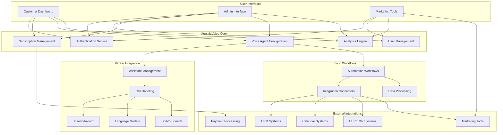
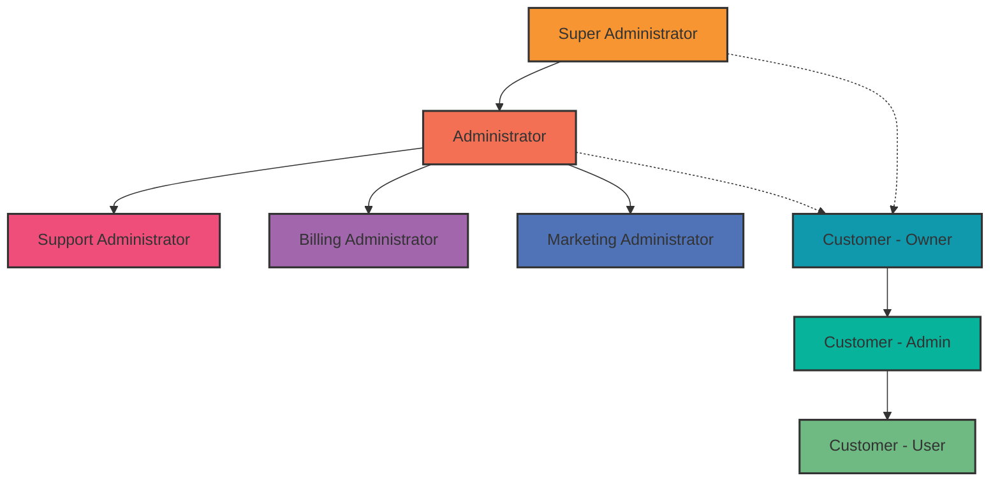
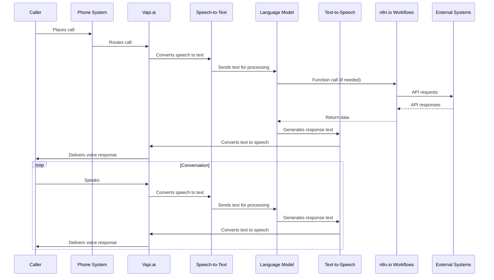
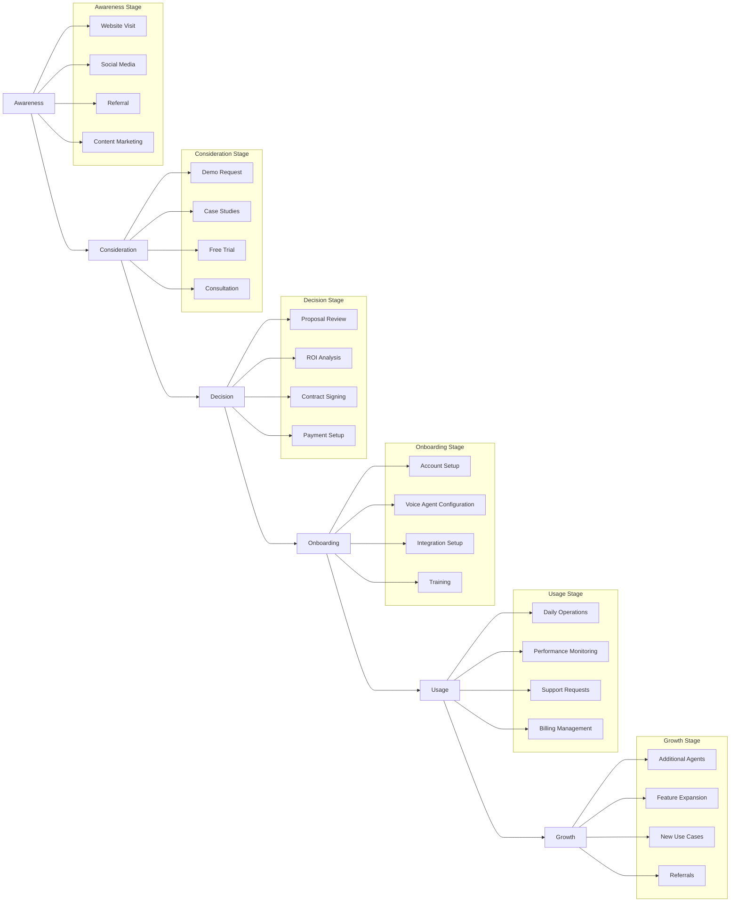
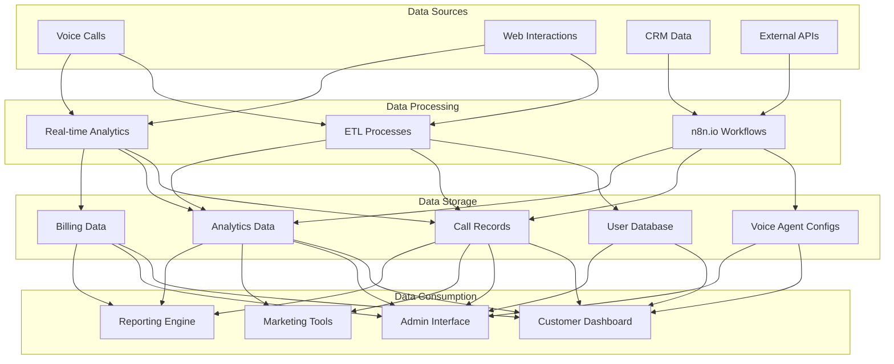
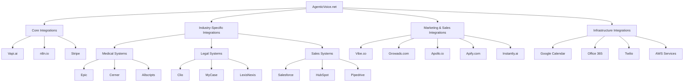
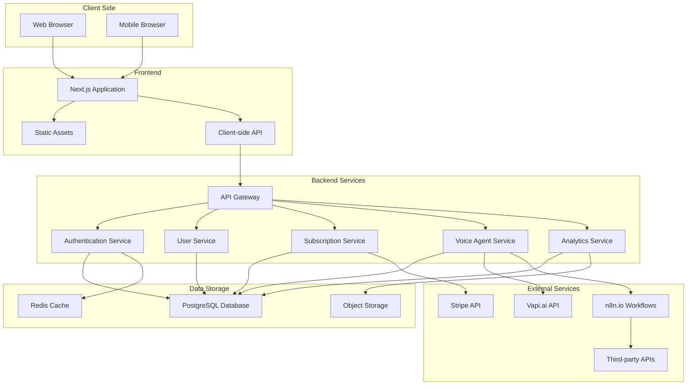
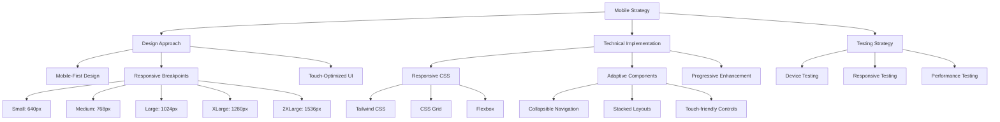

# AgenticVoice.net System Architecture and Integration Diagrams

This document provides high-level visualizations of the AgenticVoice.net system architecture, integration points, and key workflows. These diagrams complement the detailed specifications provided in the individual page documents.

## 1. Overall System Architecture

## 2. User Role Hierarchy

## 3. Voice Agent Call Flow

## 4. Customer Journey Map

## 5. Data Flow Architecture

## 6. Integration Ecosystem

## 7. Design System Component Hierarchy

```mermaid
graph TD
    A[Design System] --> B[Core Elements]
    A --> C[Components]
    A --> D[Patterns]
    A --> E[Templates]
    
    B --> B1[Colors]
    B --> B2[Typography]
    B --> B3[Spacing]
    B --> B4[Iconography]
    B --> B5[Animations]
    
    C --> C1[Basic UI]
    C --> C2[Form Elements]
    C --> C3[Navigation]
    C --> C4[Data Display]
    C --> C5[Feedback]
    
    C1 --> C1a[Buttons]
    C1 --> C1b[Cards]
    C1 --> C1c[Modals]
    
    C2 --> C2a[Inputs]
    C2 --> C2b[Selects]
    C2 --> C2c[Checkboxes]
    
    C3 --> C3a[Navbar]
    C3 --> C3b[Sidebar]
    C3 --> C3c[Tabs]
    
    C4 --> C4a[Tables]
    C4 --> C4b[Charts]
    C4 --> C4c[Lists]
    
    C5 --> C5a[Alerts]
    C5 --> C5b[Toasts]
    C5 --> C5c[Progress]
    
    D --> D1[Page Layouts]
    D --> D2[Form Patterns]
    D --> D3[Authentication]
    D --> D4[Data Loading]
    
    E --> E1[Dashboard]
    E --> E2[Settings Page]
    E --> E3[List View]
    E --> E4[Detail View]
```

## 8. Deployment Architecture

## 9. Security Architecture

```mermaid
graph TD
    subgraph "Security Layers"
        A1[Network Security]
        A2[Application Security]
        A3[Data Security]
        A4[Identity & Access]
        A5[Compliance]
    end
    
    A1 --> A1a[HTTPS/TLS]
    A1 --> A1b[DDoS Protection]
    A1 --> A1c[WAF]
    
    A2 --> A2a[Input Validation]
    A2 --> A2b[CSRF Protection]
    A2 --> A2c[XSS Prevention]
    A2 --> A2d[Rate Limiting]
    
    A3 --> A3a[Encryption at Rest]
    A3 --> A3b[Encryption in Transit]
    A3 --> A3c[Data Masking]
    A3 --> A3d[Backup & Recovery]
    
    A4 --> A4a[OAuth/OIDC]
    A4 --> A4b[RBAC]
    A4 --> A4c[MFA]
    A4 --> A4d[Session Management]
    
    A5 --> A5a[HIPAA]
    A5 --> A5b[GDPR]
    A5 --> A5c[SOC 2]
    A5 --> A5d[Audit Logging]
```

## 10. Mobile Responsiveness Strategy

